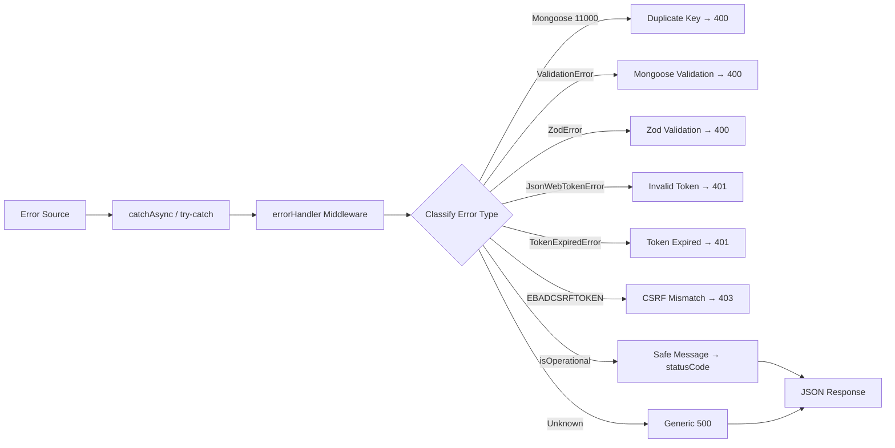
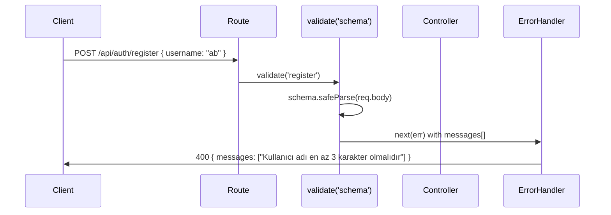

# Error Handling

This document describes the complete error handling pipeline in UBIS — from error creation to client-side recovery.

## Error Flow



## AppError Class

**File:** [`server/utils/AppError.js`](../server/utils/AppError.js)

```javascript
class AppError extends Error {
    constructor(message, statusCode) {
        super(message);
        this.statusCode = statusCode;
        this.status = `${statusCode}`.startsWith('4') ? 'fail' : 'error';
        this.isOperational = true;
        Error.captureStackTrace(this, this.constructor);
    }
}
```

| Property | Type | Description |
|----------|------|-------------|
| `message` | string | Human-readable error message |
| `statusCode` | number | HTTP status code (400, 401, 403, 404, 500) |
| `status` | string | `'fail'` for 4xx, `'error'` for 5xx |
| `isOperational` | boolean | Always `true` — marks errors safe to show to users |
| `stack` | string | Stack trace (auto-captured) |

### Usage Pattern

```javascript
const AppError = require('../utils/AppError');

// In a controller or service:
if (!user) {
    throw new AppError('User not found', 404);
}

if (!isAuthorized) {
    throw new AppError('You do not have permission', 403);
}
```

## catchAsync Wrapper

**File:** [`server/utils/catchAsync.js`](../server/utils/catchAsync.js)

```javascript
module.exports = fn => {
    return (req, res, next) => {
        fn(req, res, next).catch(next);
    };
};
```

Wraps async controller functions to automatically forward rejected promises to the error handler.

```javascript
const catchAsync = require('../utils/catchAsync');

exports.getAll = catchAsync(async (req, res, next) => {
    const data = await Service.getAll();
    res.status(200).json(data);
    // No try-catch needed — errors auto-forwarded to errorHandler
});
```

## Error Handler Middleware

**File:** [`server/middleware/errorHandler.js`](../server/middleware/errorHandler.js)

The global error handler processes all errors passed via `next(err)` or thrown in `catchAsync`.

### Error Classification

| Error Type | Detection | Result |
|-----------|-----------|--------|
| **Mongoose Duplicate Key** | `err.code === 11000` | `400` with extracted field value |
| **Mongoose Validation** | `err.name === 'ValidationError'` | `400` with field-level messages |
| **Zod Validation** | `err.error === 'Zod Validation Error'` | `400` with array of messages |
| **Invalid JWT** | `err.name === 'JsonWebTokenError'` | `401` "Invalid token" |
| **Expired JWT** | `err.name === 'TokenExpiredError'` | `401` "Token expired" |
| **CSRF Mismatch** | `err.code === 'EBADCSRFTOKEN'` | `403` "Invalid CSRF token" |
| **Operational (AppError)** | `err.isOperational === true` | Original `statusCode` + message |
| **Unknown / Programming** | Everything else | `500` generic message |

### Environment-Based Responses

#### Development

Full error details including stack trace:

```json
{
    "status": "fail",
    "error": { /* full error object */ },
    "message": "User not found",
    "messages": ["Field is required", "Invalid email"],
    "stack": "Error: User not found\n    at ..."
}
```

#### Production

Minimal, safe responses:

```json
// Operational error (safe to show)
{
    "status": "fail",
    "message": "User not found"
}

// Programming error (hidden details)
{
    "status": "error",
    "message": "Something went very wrong!"
}
```

Unknown errors are logged via Winston but never exposed to the client.

## Validation Error Patterns

### Zod Validation Flow



### Validation Error Response Format

```json
{
    "status": "fail",
    "message": "Kullanıcı adı en az 3 karakter olmalıdır",
    "messages": [
        "Kullanıcı adı en az 3 karakter olmalıdır",
        "Geçerli bir e-posta adresi giriniz"
    ]
}
```

The `messages` array allows the client to display multiple validation errors simultaneously.

## Client-Side Error Handling

### Axios Response Interceptor

```javascript
// axiosInstance.js — Response interceptor
axiosInstance.interceptors.response.use(
    response => response,
    async error => {
        const status = error.response?.status;

        if (status === 401) {
            clearAuthSession();
            window.location.href = '/login';
        }

        if (status === 403 && error.response?.data?.message?.includes('CSRF')) {
            // Auto-retry: refresh CSRF token and retry the request once
            await fetchCsrfToken();
            return axiosInstance.request(error.config);
        }

        return Promise.reject(error);
    }
);
```

### Error Recovery Strategies

| HTTP Code | Client Action |
|-----------|--------------|
| `400` | Display validation messages from `messages[]` |
| `401` | Clear session, redirect to `/login` |
| `403` (CSRF) | Auto-refresh CSRF token, retry once |
| `403` (Role) | Show "unauthorized" message |
| `404` | Show "not found" message |
| `429` | Show "too many requests, try later" |
| `500` | Show generic error toast |
| Network error | Attempt fallback to direct API URL (dev only) |

### React ErrorBoundary

Catches React rendering errors (not HTTP errors):

```jsx
<ErrorBoundary>
    <Suspense fallback={<Loading />}>
        <Routes>...</Routes>
    </Suspense>
</ErrorBoundary>
```

If a lazy-loaded component fails to render, ErrorBoundary displays a recovery UI instead of a blank page.

### Loading Timeout Recovery

If a page doesn't load within 8 seconds, a recovery button appears:

```jsx
// After 8 seconds: "Sayfa beklenenden uzun sürdü"
// Button: "Giriş ekranına dön" → clears session → /login
```

## Common Error Scenarios

| Scenario | Error Chain | User Sees |
|----------|------------|-----------|
| Wrong password | Service → `AppError(401)` → errorHandler | "Invalid credentials" |
| Expired token | JWT verify → `TokenExpiredError` → errorHandler | Redirect to login |
| Duplicate email | Mongoose save → code 11000 → errorHandler | "Duplicate field value: ..." |
| Missing required field | Zod parse fails → errorHandler | Field-specific message |
| Admin-only endpoint | `restrictTo('admin')` → `AppError(403)` | "No permission" |
| Redis down | Cache middleware → catch → `next()` | No error (graceful skip) |
| MeiliSearch down | Post-hook → catch → `logger.error()` | No error (silent fail) |
