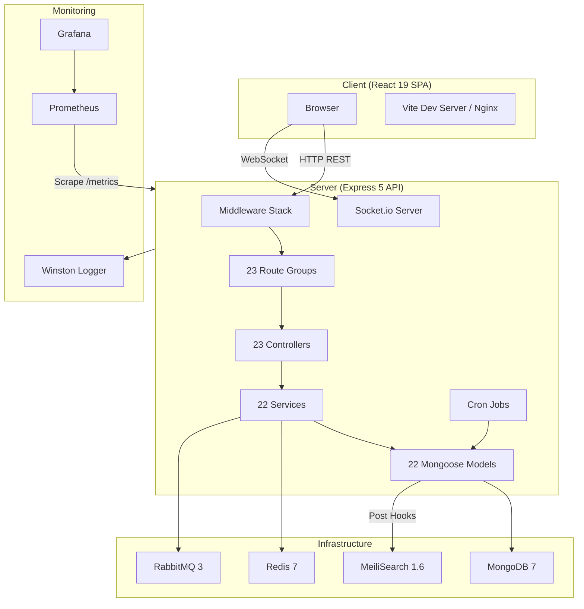
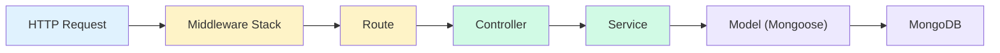
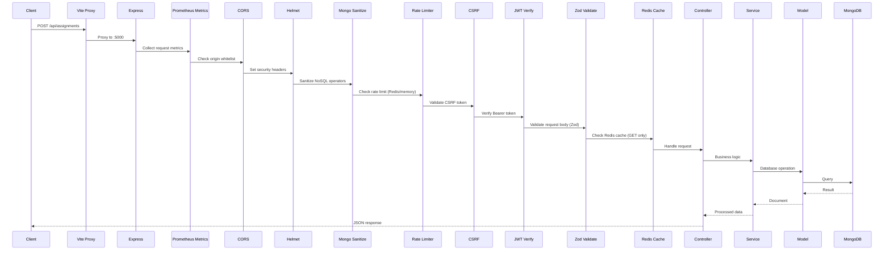
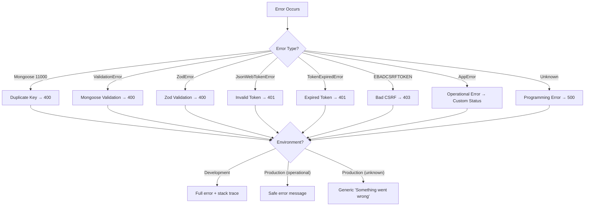

# Architecture

This document describes the high-level system architecture of UBIS, covering the technology choices, layered design patterns, request lifecycle, and resilience strategies.

## System Overview



## Technology Stack

| Layer | Technology | Version | Purpose |
|-------|-----------|---------|---------|
| **Frontend** | React | 19.2 | UI framework |
| | Vite | 6.x | Build tool & dev server |
| | TailwindCSS | 3.4 | Utility-first CSS |
| | Zustand | 5.x | Client-side state management |
| | TanStack Query | 5.x | Server state & data fetching |
| | React Router | 7.x | Client-side routing |
| | Framer Motion | 12.x | Animation library |
| | Socket.io Client | 4.8 | Real-time WebSocket client |
| | Recharts | 3.x | Chart visualization |
| | Leaflet | 1.9 | Interactive maps |
| | i18next | 25.x | Internationalization |
| | Lucide React | 0.563 | Icon library |
| **Backend** | Express | 5.2 | HTTP framework |
| | Mongoose | 9.2 | MongoDB ODM |
| | JSON Web Token | 9.x | Authentication tokens |
| | bcrypt | 6.x | Password hashing |
| | csrf-csrf | 3.x | CSRF protection (Double Submit Cookie) |
| | Passport | 0.7 | OAuth strategies (Google) |
| | Speakeasy | 2.x | TOTP-based 2FA |
| | Zod | 4.x | Input validation |
| | Swagger | 6.x | API documentation |
| | Winston | 3.x | Structured logging |
| | Socket.io | 4.8 | WebSocket server |
| | node-cron | 4.x | Scheduled tasks |
| | Multer | 2.x | File uploads |
| **Database** | MongoDB | 7.x | Primary datastore |
| **Cache** | Redis | 7.x | Response caching, rate limiting |
| **Message Queue** | RabbitMQ | 3.x | Async event processing |
| **Search** | MeiliSearch | 1.6 | Full-text search engine |
| **Monitoring** | Prometheus | — | Metrics collection |
| | Grafana | — | Metrics visualization |
| **CI/CD** | GitHub Actions | — | Automated lint, test, build |
| **Container** | Docker Compose | — | Development & production |
| | Kubernetes | — | Orchestration (manifests) |

## Layered Architecture

The backend follows a strict **Controller → Service → Model** layered architecture:



### Layer Responsibilities

| Layer | Responsibility | Example |
|-------|---------------|---------|
| **Middleware** | Cross-cutting concerns: auth, CSRF, rate limiting, validation, caching | `auth.js`, `validate.js`, `cache.js` |
| **Route** | HTTP method + path mapping, middleware chaining | `routes/students.js` |
| **Controller** | Request/response handling, error translation, metrics | `authController.js` |
| **Service** | Business logic, data transformation, external integrations | `authService.js` |
| **Model** | Data schema, validation rules, indexes, hooks | `User.js`, `Student.js` |

## Directory Structure

```
ubis/
├── client/                     # Frontend SPA
│   └── src/
│       ├── api/                #   Axios instance + CSRF management
│       ├── components/         #   Reusable UI components (13 categories)
│       ├── context/            #   React context providers (Socket.io)
│       ├── hooks/              #   Custom React hooks (8 hooks)
│       ├── layouts/            #   Dashboard layout + sidebar
│       ├── pages/              #   121+ page components
│       │   ├── dashboard/      #     119 dashboard pages
│       │   └── academic/       #     2 academic pages
│       ├── store/              #   Zustand state management
│       └── utils/              #   Auth storage, data utilities
│
├── server/                     # Backend API
│   ├── controllers/  (23)      #   Request handlers
│   ├── services/     (22)      #   Business logic
│   ├── models/       (22)      #   Mongoose schemas
│   ├── routes/       (23)      #   Express routes
│   ├── middleware/   (7)       #   Express middleware
│   ├── utils/        (11)      #   Shared utilities
│   ├── jobs/         (1)       #   Cron scheduled tasks
│   ├── consumers/    (1)       #   RabbitMQ consumers
│   ├── socket/       (1)       #   Socket.io server setup
│   ├── tests/        (8)       #   Jest unit tests
│   └── index.js                #   Application entry point
│
├── docker/                     # Container configurations
│   ├── docker-compose.yml      #   Development (7 services)
│   ├── docker-compose.prod.yml #   Production
│   └── docker-compose.monitoring.yml  # Prometheus + Grafana
│
├── k8s/                        # Kubernetes manifests
├── scripts/                    # Data generation scripts (14 files)
└── .github/workflows/          # CI/CD pipeline
```

## Request Lifecycle

A typical authenticated API request passes through these stages:



## Middleware Stack Order

The middleware is applied in a specific order in `server/index.js`:

| Order | Middleware | Purpose |
|-------|-----------|---------|
| 1 | `express-prom-bundle` | Prometheus metrics collection |
| 2 | `cors` | Cross-Origin Resource Sharing |
| 3 | `helmet` | Security HTTP headers |
| 4 | `mongoSanitizeCompat` | NoSQL injection prevention |
| 5 | `morgan` | HTTP request logging (dev: console, prod: winston) |
| 6 | `express.json()` | JSON body parsing |
| 7 | `cookie-parser` | Cookie parsing (for CSRF) |
| 8 | `generalLimiter` | Rate limiting: 100 req / 15 min |
| 9 | `authLimiter` | Auth rate limiting: 20 req / 15 min |
| 10 | `doubleCsrfProtection` | CSRF token validation |
| 11 | `verifyToken` | JWT authentication (per-route) |
| 12 | `verifyRole` / `restrictTo` | Role-based authorization (per-route) |
| 13 | `validate` | Zod schema validation (per-route) |
| 14 | `cacheMiddleware` | Redis response caching (per-route) |
| 15 | `errorHandler` | Global error handling (last) |

## Error Handling Flow



## Graceful Degradation

UBIS is designed to continue operating even when optional infrastructure services are unavailable:

| Service | Status When Unavailable | Fallback Behavior |
|---------|------------------------|-------------------|
| **Redis** | ⚠️ Degraded | In-memory rate limiting, caching disabled, cache middleware skipped |
| **RabbitMQ** | ⚠️ Degraded | Async notifications disabled, email events dropped with warning |
| **MeiliSearch** | ⚠️ Degraded | Search functionality unavailable, index sync hooks log errors silently |
| **MongoDB** | ❌ Critical | Application cannot start — primary datastore |

### Resilience Patterns

- **Redis**: Exponential backoff reconnect (250ms → 3s), max 3 retries, then disables Redis features
- **RabbitMQ**: Single connection attempt, marks broker as disabled on failure, logs warning
- **Port Binding**: Automatic port increment retry (up to 10 attempts) if port is in use
- **Graceful Shutdown**: SIGTERM/SIGINT handlers close HTTP server, MongoDB, Redis, and RabbitMQ connections with a 10-second forced timeout

## Scalability Considerations

### Current Architecture Supports

- **Horizontal API scaling** via Docker/K8s replicas (stateless JWT auth)
- **Redis-backed rate limiting** shared across instances
- **Message queue decoupling** for async email/notification processing
- **Full-text search offloading** to MeiliSearch (separate from MongoDB)
- **Response caching** with user-scoped Redis keys

### Future Improvements

- API Gateway (Nginx) for load balancing across multiple server instances
- Redis Cluster for high-availability caching
- MongoDB Replica Set for read scaling
- Kubernetes HPA (Horizontal Pod Autoscaler) based on Prometheus metrics
- CDN for static frontend assets
