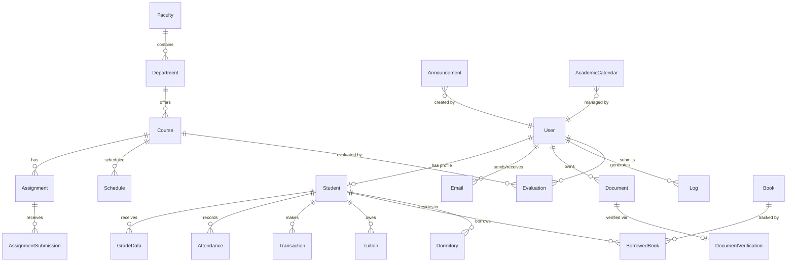

# Database Schema

This document describes all 22 Mongoose models, their fields, relationships, indexes, and special behaviors (MeiliSearch auto-sync hooks).

## Entity Relationship Diagram

---

## Models Overview

| Model | Collection | Fields | Key Features |
|-------|-----------|--------|--------------|
| [User](#user) | `users` | 10 | Auth, roles, 2FA, MeiliSearch sync |
| [Student](#student) | `students` | 25 | Demographics, program info, YKS data |
| [Course](#course) | `courses` | 7 | Credits, ECTS, MeiliSearch sync |
| [Faculty](#faculty) | `faculties` | 3 | University organizational unit |
| [Department](#department) | `departments` | 3 | Under faculties |
| [GradeData](#gradedata) | `gradedatas` | 7 | Course grades per student |
| [Assignment](#assignment) | `assignments` | 7 | Homework/project tracking |
| [AssignmentSubmission](#assignmentsubmission) | `assignmentsubmissions` | 7 | Student submissions with files |
| [Attendance](#attendance) | `attendances` | 5 | Class attendance records |
| [Schedule](#schedule) | `schedules` | 8 | Weekly class timetable |
| [AcademicCalendar](#academiccalendar) | `academiccalendars` | 4 | Semester events |
| [Announcement](#announcement) | `announcements` | 5 | System announcements, MeiliSearch sync |
| [Email](#email) | `emails` | 7 | Internal messaging |
| [Document](#document) | `documents` | 6 | User-uploaded documents |
| [DocumentVerification](#documentverification) | `documentverifications` | 5 | QR-based document verification |
| [Evaluation](#evaluation) | `evaluations` | 6 | Course evaluations/surveys |
| [Transaction](#transaction) | `transactions` | 6 | Financial transactions |
| [Tuition](#tuition) | `tuitions` | 6 | Tuition fee records |
| [Book](#book) | `books` | 4 | Library catalog |
| [BorrowedBook](#borrowedbook) | `borrowedbooks` | 6 | Library borrowing records |
| [Dormitory](#dormitory) | `dormitories` | 4 | Dormitory assignments |
| [Log](#log) | `logs` | 4 | System audit logs |

---

## Model Details

### User

**File:** [`server/models/User.js`](../server/models/User.js)

| Field | Type | Required | Unique | Default | Description |
|-------|------|----------|--------|---------|-------------|
| `username` | String | ✅ | ✅ | — | Login identifier (e.g., student number) |
| `password` | String | ✅ | — | — | bcrypt-hashed password |
| `role` | String | — | — | `student` | Enum: `student`, `academic`, `admin` |
| `fullName` | String | — | — | — | Display name |
| `email` | String | — | ✅ (sparse) | — | Email address |
| `googleId` | String | — | sparse | — | Google OAuth identifier |
| `twoFactorSecret` | String | — | — | — | TOTP secret (Speakeasy) |
| `isTwoFactorEnabled` | Boolean | — | — | `false` | 2FA activation status |
| `passwordResetToken` | String | — | — | — | Hashed reset token |
| `passwordResetExpires` | Date | — | — | — | Token expiration time |

**Indexes:** `{ role: 1 }`, `{ email: 1 }`

**MeiliSearch Hooks:** Auto-syncs student-role users to `students` index on save/update/delete.

---

### Student

**File:** [`server/models/Student.js`](../server/models/Student.js)

| Field | Type | Required | Description |
|-------|------|----------|-------------|
| `userId` | ObjectId (ref: User) | — | Link to User account |
| `id` | String | ✅ (unique) | Student number (e.g., `B211200051`) |
| `name` | String | ✅ | Full name |
| `faculty` | String | ✅ | Faculty name |
| `department` | String | ✅ | Department name |
| `gpa` | Number | — | Grade point average |
| `semester` | Number | — | Current semester |
| `status` | String | — | Enrollment status |
| `email` | String | — | University email |
| `tcNo` | String | — | National ID number |
| `nationality` | String | — | Nationality |
| `birthDate` | Date | — | Date of birth |
| `birthPlace` | String | — | Place of birth |
| `gender` | String | — | Gender |
| `phone` | String | — | Phone number |
| `personalEmail` | String | — | Personal email |
| `address` | String | — | Home address |
| `emergencyContact` | String | — | Emergency contact info |
| `programLanguage` | String | — | e.g., Turkish, English |
| `educationType` | String | — | e.g., Örgün, İkinci Öğretim |
| `degreeLevel` | String | — | e.g., Lisans, Yüksek Lisans |
| `registrationType` | String | — | e.g., YKS, DGS, Yatay Geçiş |
| `registrationDate` | Date | — | Enrollment date |
| `advisor` | String | — | Academic advisor name |
| `scholarship` | String | — | Scholarship info |
| `highSchool` | String | — | High school name |
| `graduationYear` | Number | — | HS graduation year |
| `diplomaGrade` | String | — | HS diploma grade |
| `examYear` | Number | — | YKS exam year |
| `examScore` | String | — | YKS score |
| `placementRank` | String | — | YKS placement rank |

**Indexes:** `{ faculty: 1, department: 1 }`, `{ status: 1 }`, `{ email: 1 }`, `{ userId: 1 }`

---

### Course

**File:** [`server/models/Course.js`](../server/models/Course.js)

| Field | Type | Required | Default | Description |
|-------|------|----------|---------|-------------|
| `code` | String | ✅ (unique) | — | Course code (e.g., `BLM101`) |
| `name` | String | ✅ | — | Course name |
| `credit` | Number | ✅ | — | Credit hours |
| `ects` | Number | ✅ | — | ECTS credits |
| `type` | String | — | `Zorunlu` | `Zorunlu` or `Seçmeli` |
| `instructor` | String | — | `Atanmadı` | Instructor name |
| `semester` | String | — | `Güz` | Semester (Güz/Bahar) |

**Indexes:** `{ instructor: 1 }`, `{ semester: 1, type: 1 }`

**MeiliSearch Hooks:** Auto-syncs to `courses` index on save/update/delete.

---

### Announcement

**File:** [`server/models/Announcement.js`](../server/models/Announcement.js)

| Field | Type | Required | Default | Description |
|-------|------|----------|---------|-------------|
| `title` | String | ✅ | — | Announcement title (trimmed) |
| `text` | String | ✅ | — | Announcement body |
| `category` | String (enum) | — | `genel` | `academic`, `administrative`, `events`, `genel`, `fakulte`, `ders` |
| `priority` | String (enum) | — | `normal` | `normal`, `high`, `urgent` |
| `author` | String | — | `Sistem Yöneticisi` | Author name |

**Indexes:** `{ category: 1, createdAt: -1 }`, `{ priority: 1 }`

**MeiliSearch Hooks:** Auto-syncs to `announcements` index on save/update/delete.

---

### Assignment

**File:** [`server/models/Assignment.js`](../server/models/Assignment.js)

| Field | Type | Required | Default | Description |
|-------|------|----------|---------|-------------|
| `course` | String | ✅ | — | Course name |
| `courseCode` | String | ✅ | — | Course code |
| `title` | String | ✅ | — | Assignment title |
| `dueDate` | Date | ✅ | — | Submission deadline |
| `daysLeft` | Number | — | `0` | Computed days remaining |
| `status` | String | ✅ | — | `Bekliyor`, `Tamamlandı`, `Gecikti` |
| `type` | String | — | `Ödev` | `Ödev` or `Proje` |

**Indexes:** `{ status: 1, dueDate: 1 }`

---

### Email

**File:** [`server/models/Email.js`](../server/models/Email.js)

| Field | Type | Required | Default | Description |
|-------|------|----------|---------|-------------|
| `sender` | String | ✅ | — | Sender identifier |
| `receiver` | String | ✅ | — | Receiver identifier |
| `subject` | String | ✅ | — | Email subject |
| `preview` | String | ✅ | — | Email body/preview |
| `read` | Boolean | — | `false` | Read status |
| `folder` | String (enum) | — | `Gelen Kutusu` | `Gelen Kutusu`, `Arşiv`, `Çöp Kutusu`, `Yıldızlı` |
| `date` | Date | — | `Date.now` | Send date |

**Indexes:** `{ receiver: 1, read: 1, createdAt: -1 }`, `{ sender: 1, createdAt: -1 }`, `{ folder: 1 }`

---

### Transaction

**File:** [`server/models/Transaction.js`](../server/models/Transaction.js)

| Field | Type | Required | Description |
|-------|------|----------|-------------|
| `userId` | String | ✅ | User identifier |
| `title` | String | ✅ | Transaction description |
| `amount` | Number | ✅ | Positive=income, Negative=expense |
| `type` | String (enum) | ✅ | `income` or `expense` |
| `category` | String | ✅ | e.g., `Yemek`, `Ceza`, `Transfer` |
| `date` | Date | — | `Date.now` |

**Indexes:** `{ userId: 1, date: -1 }`, `{ type: 1, date: 1 }`

---

### Dormitory

**File:** [`server/models/Dormitory.js`](../server/models/Dormitory.js)

| Field | Type | Required | Description |
|-------|------|----------|-------------|
| `studentNo` | String | ✅ (unique) | Student number |
| `info.room` | String | — | Room number |
| `info.type` | String | — | Room type |
| `info.bed` | String | — | Bed assignment |
| `info.friends` | [String] | — | Roommate names |
| `paymentStatus.status` | String | — | Payment status |
| `paymentStatus.amount` | Number | — | Payment amount |
| `paymentStatus.lastPaymentBase` | Date | — | Last payment date |
| `paymentStatus.nextPayment` | Date | — | Next payment date |
| `permissions` | [Permission] | — | Leave permission requests |

**Permission Sub-schema:** `{ date: Date, type: String, status: Enum['Bekliyor','Onaylandı','Reddedildi'] }`

---

### Log

**File:** [`server/models/Log.js`](../server/models/Log.js)

| Field | Type | Required | Default | Description |
|-------|------|----------|---------|-------------|
| `user` | String | ✅ | — | Username |
| `action` | String | ✅ | — | Action performed |
| `status` | String (enum) | — | `success` | `success` or `error` |
| `ip` | String | — | `127.0.0.1` | Client IP address |

**Indexes:** `{ user: 1, createdAt: -1 }`, `{ action: 1 }`

---

## Index Strategy

### Performance Indexes

| Model | Index | Purpose |
|-------|-------|---------|
| User | `{ username: 1 }` (unique) | Login lookups |
| User | `{ role: 1 }` | Role-based filtering |
| Student | `{ id: 1 }` (unique) | Student number lookups |
| Student | `{ faculty: 1, department: 1 }` | Department-level queries |
| Course | `{ code: 1 }` (unique) | Course code lookups |
| Email | `{ receiver: 1, read: 1, createdAt: -1 }` | Inbox queries |
| Transaction | `{ userId: 1, date: -1 }` | User transaction history |
| Announcement | `{ category: 1, createdAt: -1 }` | Filtered announcement feeds |
| Assignment | `{ status: 1, dueDate: 1 }` | Due date tracking (cron jobs) |

### Sparse Indexes

- `User.email` — Sparse unique (allows null)
- `User.googleId` — Sparse (only for OAuth users)

---

## MeiliSearch Auto-Sync

Three models have Mongoose post-hooks that automatically sync data to MeiliSearch:

| Model | MeiliSearch Index | Synced Fields | Hooks |
|-------|------------------|---------------|-------|
| **User** (student role only) | `students` | `id`, `username`, `fullName`, `email` | `post('save')`, `post('findOneAndUpdate')`, `post('findOneAndDelete')` |
| **Course** | `courses` | `id`, `code`, `title`, `instructor`, `credits` | `post('save')`, `post('findOneAndUpdate')`, `post('findOneAndDelete')` |
| **Announcement** | `announcements` | `id`, `title`, `text`, `category` | `post('save')`, `post('findOneAndUpdate')`, `post('findOneAndDelete')` |

All sync errors are logged silently via Winston to prevent application crashes.

---

## Seed Data

### Available Scripts

| Script | Purpose | Location |
|--------|---------|----------|
| `seed.js` | Base data (admin user, courses, announcements) | `server/seed.js` |
| `import-students-simple.js` | Create test students | `server/import-students-simple.js` |
| `import-students.js` | Detailed student import | `server/import-students.js` |
| `seed-real-data.js` | Realistic data generation | `server/seed-real-data.js` |
| `generate-foundation-data.js` | Foundation-level data | `server/generate-foundation-data.js` |
| `sync-students-to-users.js` | Sync Student records → User accounts | `server/sync-students-to-users.js` |

### Data Generation Scripts (`scripts/`)

14 specialized scripts for generating realistic test data:

- `generate-students.js` — Student records
- `generate-staff.js` — Academic staff
- `generate-courses.js` — Course catalog
- `generate-program-courses.js` — Program-course mapping
- `generate-campus.js` / `generate-campus-v2.js` — Campus data
- `generate-indices.js` — Database indexes
- `generate-social-evidence.js` — Social transcript data
- `enrich-student-data.js` (v1–v5) — Progressive student data enrichment
- `scaffold-data.js` — Complete data scaffolding
