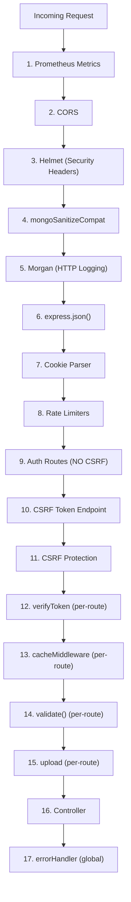

# Middleware Reference

This document provides a detailed reference for all Express middleware modules in the UBIS server. Middleware is executed in a specific order defined in `server/index.js`.

## Middleware Execution Order



> **Key insight:** Auth routes are registered **before** CSRF protection so login/register don't require a CSRF token.

---

## Global Middleware

Applied to all requests in `server/index.js`:

### 1. Prometheus Metrics

```javascript
app.use(promBundle({
    includeMethod: true,
    includePath: true,
    includeStatusCode: true,
    includeUp: true,
    customLabels: { project_name: 'ubis_obs' }
}));
```

Exposes metrics at `GET /metrics` for Prometheus scraping. See [Monitoring](../infrastructure/MONITORING.md).

### 2. CORS — Cross-Origin Resource Sharing

```javascript
app.use(cors({
    origin: (origin, callback) => { /* whitelist check */ },
    credentials: true,
    methods: ['GET', 'POST', 'PUT', 'DELETE', 'PATCH']
}));
```

### 3. Helmet — Security Headers

```javascript
app.use(helmet());
```

Sets HTTP security headers. See [Security](../security/SECURITY.md#1-http-security-headers-helmet).

### 4. mongoSanitizeCompat — NoSQL Injection Prevention

```javascript
app.use(mongoSanitizeCompat);
```

### 5. Morgan — HTTP Request Logging

```javascript
// Development: colored, concise
app.use(morgan('dev'));

// Production: full Apache-style, piped to Winston
app.use(morgan('combined', { stream: { write: message => logger.info(message.trim()) } }));
```

### 6. Body Parser

```javascript
app.use(express.json());
```

> **Note:** Only `express.json()` is used. `express.urlencoded()` is **not** configured — the API accepts JSON bodies exclusively.

### 7. Cookie Parser

```javascript
app.use(cookieParser());
```

Required for CSRF Double Submit Cookie pattern. Parses `Cookie` headers into `req.cookies`.

### 8. Rate Limiters

Two rate limiters applied globally (see [Security — Rate Limiting](../security/SECURITY.md#3-rate-limiting)):

```javascript
app.use('/api/', generalLimiter);    // 100 req / 15 min
app.use('/api/auth', authLimiter);   // 20 req / 15 min
```

---

## Route-Level Middleware

Applied to specific routes or route groups:

### auth.js — Authentication & Authorization

**File:** [`server/middleware/auth.js`](../server/middleware/auth.js)

Exports 4 middleware functions:

#### `verifyToken`

Validates JWT from `Authorization: Bearer <token>` header.

| Input | Output | Error |
|-------|--------|-------|
| `Authorization` header | `req.user = { id, role, username }` | `401` if missing or invalid |

```javascript
// Usage: Applied at route-group level
app.use("/api/courses", verifyToken, coursesRoute);
```

#### `verifyRole(roles[])`

Combines `verifyToken` + role check in a single middleware. Used at route-mount level.

| Input | Output | Error |
|-------|--------|-------|
| Array of role strings | Verified user with matching role | `403` if role not in array |

```javascript
// Usage: Entire route group requires admin
app.use("/api/logs", verifyRole(['admin']), logsRoute);
```

#### `restrictTo(...roles)`

Role check only. **Requires `verifyToken` to have already run.**

| Input | Output | Error |
|-------|--------|-------|
| Spread of role strings | Pass-through if role matches | `403` if role not in list |

```javascript
// Usage: Within a route file, after verifyToken
router.post('/', restrictTo('admin', 'academic'), controller.create);
```

#### `verifyOwnerOrStaff`

Ownership-based access control. Checks if requesting user is the resource owner OR has staff privileges.

| Check | Passes If |
|-------|-----------|
| MongoDB ObjectId match | `req.user.id === req.params.id` |
| Username match | `req.user.username === req.params.id` (case-insensitive) |
| Staff role | `req.user.role === 'admin'` or `'academic'` |

```javascript
// Usage: Student profile access
router.get('/:id', verifyToken, verifyOwnerOrStaff, controller.getById);
```

---

### validate.js — Zod Input Validation

**File:** [`server/middleware/validate.js`](../server/middleware/validate.js)

Factory function that creates validation middleware from named Zod schemas.

```javascript
const { validate } = require('../middleware/validate');

router.post('/register', validate('register'), controller.register);
```

#### Available Schemas

| Schema Name | Endpoint | Validated Fields |
|-------------|----------|-----------------|
| `register` | `POST /auth/register` | `username` (3-30), `email` (valid), `password` (6-128), `fullName` (opt), `faculty` (opt), `department` (opt) |
| `login` | `POST /auth/login` | `username` (min 1), `password` (min 1) |
| `forgotPassword` | `POST /auth/forgot-password` | `email` (valid email) |
| `announcement` | `POST /announcements` | `title` (3-200), `text` (min 5), `category` (opt enum) |
| `evaluation` | `POST /evaluations` | `courseId` (min 1), `answers` (record), `comment` (opt, max 1000) |

#### Validation Flow

```
1. validate('register') called
2. Finds schema by name
3. schema.safeParse(req.body)
4. Success → req.body = result.data (cleaned) → next()
5. Failure → err with messages[] → errorHandler → 400
```

**Important:** On success, `req.body` is replaced with the parsed/cleaned data, stripping any extra fields not in the schema.

---

### cache.js — Redis Response Cache

**File:** [`server/middleware/cache.js`](../server/middleware/cache.js)

Caches successful GET responses in Redis.

| Property | Value |
|----------|-------|
| TTL | 600 seconds (10 minutes) |
| Key format | `api-cache:{userId}:GET:{url}` |
| Bypass | `?nocache=1` |
| Response headers | `X-Cache: HIT` or `X-Cache: MISS` |

```javascript
// Usage: Applied to specific routes
router.get('/', verifyToken, cacheMiddleware, controller.getAll);
```

**How it works:**
1. Only caches `GET` requests
2. Checks `?nocache=1` bypass
3. Builds user-scoped cache key
4. If Redis has data → return cached JSON with `X-Cache: HIT`
5. If cache miss → intercept `res.json()`, cache the response, set `X-Cache: MISS`
6. If Redis unavailable → skip caching entirely

---

### upload.js — File Upload (Multer)

**File:** [`server/middleware/upload.js`](../server/middleware/upload.js)

Configures Multer for disk-based file uploads.

| Property | Value |
|----------|-------|
| Storage | Disk (`uploads/` directory) |
| Max file size | **10 MB** |
| Allowed types | `jpeg`, `jpg`, `png`, `pdf`, `doc`, `docx`, `zip`, `rar` |
| Filename format | `{fieldname}-{timestamp}-{random}{ext}` |

```javascript
// Usage: Single file upload
router.post('/', verifyToken, upload.single('file'), controller.upload);

// Usage: Multiple files
router.post('/', verifyToken, upload.array('files', 5), controller.upload);
```

**Validation:** Checks both file extension and MIME type. Rejects with `AppError(400)` if invalid.

---

### secureUploads.js — Token-Based File Serving

**File:** [`server/middleware/secureUploads.js`](../server/middleware/secureUploads.js)

Protects uploaded files with JWT authentication and ownership checks.

```javascript
// Usage: Static file serving with access control
app.use('/uploads', secureUploads, express.static('uploads'));
```

| Check | Rule |
|-------|------|
| Authentication | JWT token required (from `Authorization` header) |
| Owner access | File starts with `{userId}-` |
| Staff access | Admin or academic role can access all files |
| Unauthorized | `403` error |

---

### mongoSanitizeCompat.js — NoSQL Injection Prevention

**File:** [`server/middleware/mongoSanitizeCompat.js`](../server/middleware/mongoSanitizeCompat.js)

Express 5 compatibility wrapper for `express-mongo-sanitize`.

```javascript
// Sanitizes in-place (Express 5 compatibility)
// Replaces $ operators with _ in:
//   - req.body
//   - req.params
//   - req.headers
//   - req.query
```

**Why a custom wrapper?** Express 5 changed `req.query` to a getter-only property. This middleware sanitizes the object in-place instead of reassigning it.

---

### errorHandler.js — Global Error Handler

**File:** [`server/middleware/errorHandler.js`](../server/middleware/errorHandler.js)

The final middleware in the chain. Catches all errors and sends appropriate responses.

See [Error Handling](../api/ERROR_HANDLING.md) for complete documentation.

---

## Middleware Dependency Map

```
verifyRole ──────► verifyToken (embedded)
restrictTo ──────► requires verifyToken to run first
verifyOwnerOrStaff ► requires verifyToken to run first
cacheMiddleware ──► requires verifyToken for user-scoped keys
secureUploads ────► independent JWT verification
validate ─────────► independent (schema-based)
upload ───────────► independent (Multer-based)
```
