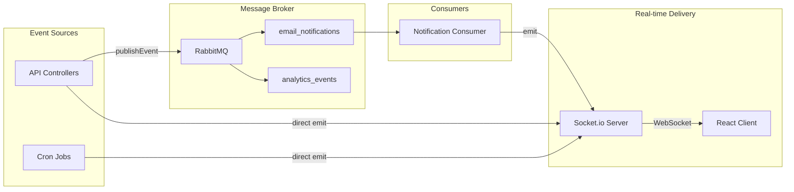
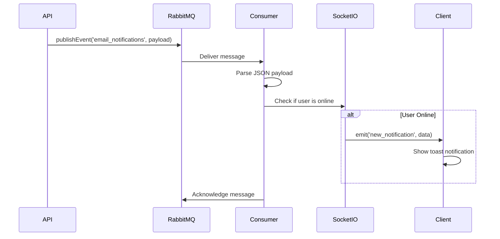

# Real-time Systems

This document covers the real-time communication architecture in UBIS, including Socket.io WebSocket events, RabbitMQ message queuing, and scheduled cron jobs.

## Architecture Overview



---

## Socket.io

### Server Setup

**File:** [`server/socket/index.js`](../server/socket/index.js)

| Property | Value |
|----------|-------|
| Ping timeout | 60 seconds |
| Ping interval | 25 seconds |
| CORS (dev) | Allow all origins |
| CORS (prod) | `CLIENT_URL` only |
| Auth | JWT token in `socket.handshake.auth.token` |

### Authentication Middleware

Every socket connection requires a valid JWT token:

```javascript
io.use((socket, next) => {
    const token = socket.handshake.auth?.token
                  || socket.handshake.headers?.authorization?.split(' ')[1];
    if (!token) return next(new Error('Authentication required'));
    socket.user = jwt.verify(token, process.env.JWT_SEC);
    next();
});
```

### Events

#### Server → Client Events

| Event | Payload | Description |
|-------|---------|-------------|
| `new_announcement` | `{ title, text, category }` | New announcement published |
| `new_assignment` | `{ message }` | New assignment created |
| `new_grade` | `{ message }` | Grade posted |
| `new_notification` | `{ title, message, type, timestamp }` | Generic notification (from RabbitMQ) |
| `online_users_count` | `number` | Updated online user count |
| `receive_message` | `{ room, ...data }` | Room-based message |

#### Client → Server Events

| Event | Payload | Description |
|-------|---------|-------------|
| `register_user` | `{ userId, username }` | Register identity for targeted notifications |
| `join_room` | `roomId` (string) | Join a messaging room |
| `send_message` | `{ room, ...data }` | Send message to a room |

### Online User Tracking

The server maintains two in-memory maps:

```javascript
const onlineUsers = new Map();    // userKey → socketId
const socketUserKeys = new Map(); // socketId → Set<userKey>
```

- A user can register with both `userId` (MongoDB ObjectId) and `username`
- On disconnect, all associated keys are cleaned up
- Online count is broadcast to all clients on connect/disconnect

### Client Integration

**File:** [`client/src/context/SocketContext.jsx`](../client/src/context/SocketContext.jsx)

```jsx
// Connection config
const socket = io('/', {
    transports: ['polling', 'websocket'],
    withCredentials: true,
    autoConnect: false,
    reconnection: true,
    reconnectionAttempts: 10,
    reconnectionDelay: 2000,
    timeout: 60000,
    auth: { token: getToken() }
});

// Only connects when user is authenticated
// Auto-registers identity on connect
// Listens for: new_announcement, new_assignment, new_grade, new_notification
```

**Notification State:**
- Stored in React state via `SocketContext`
- `notifications[]` array with `{ id, type, message, read }`
- `markAsRead(id)` and `markAllAsRead()` functions
- Toast notifications via `react-toastify`

---

## RabbitMQ Message Broker

### Connection Management

**File:** [`server/utils/messageBroker.js`](../server/utils/messageBroker.js)

| Property | Value |
|----------|-------|
| URL | `RABBITMQ_URL` env var or `amqp://localhost:5672` |
| Queues | `email_notifications`, `analytics_events` |
| Message persistence | `persistent: true` |
| Fallback | Silently disables broker features if unavailable |

### Queues

| Queue | Purpose | Consumer |
|-------|---------|----------|
| `email_notifications` | Email sending + real-time notifications | `notificationConsumer.js` |
| `analytics_events` | Analytics event tracking | Not yet implemented |

### Publishing Events

```javascript
const messageBroker = require('./utils/messageBroker');

await messageBroker.publishEvent('email_notifications', {
    email: 'student@example.com',
    subject: 'Password Reset',
    message: 'Click the link to reset...',
    userId: '664a...',
    username: 'B211200051'
});
```

### Notification Consumer

**File:** [`server/consumers/notificationConsumer.js`](../server/consumers/notificationConsumer.js)

Flow:
1. Consumes messages from `email_notifications` queue
2. Parses JSON payload
3. Looks up target user in online users map
4. If online → emits `new_notification` via Socket.io
5. Acknowledges message from queue
6. On parse error → message stays in queue for retry



---

## Cron Jobs

**File:** [`server/jobs/cronTasks.js`](../server/jobs/cronTasks.js)

### Job 1: Assignment Due-Date Check

| Property | Value |
|----------|-------|
| Schedule | `0 0 * * *` (midnight daily) |
| Purpose | Mark overdue assignments as "Gecikti" |
| Operation | Bulk `updateMany` on Assignment model |

```javascript
// Updates all assignments where:
// - status is not 'Tamamlandı' or 'Gecikti'
// - dueDate has passed
await Assignment.updateMany(
    { status: { $nin: ['Tamamlandı', 'Gecikti'] }, dueDate: { $lt: now } },
    { $set: { status: 'Gecikti' } }
);
```

### Job 2: Library Due-Date Alerts

| Property | Value |
|----------|-------|
| Schedule | `0 8 * * *` (daily at 8 AM) |
| Purpose | Email students about approaching book return deadlines |
| Lookahead | 3 days before due date |

Flow:
1. Find all borrowed books due within 3 days
2. Batch-fetch associated student users
3. Send email notification to each student
4. Bulk-update book status to "Süresi Yaklaşıyor"

**Optimizations:**
- Batch user lookup (single query for all student numbers)
- Bulk write for status updates
- Graceful email failure handling (logs warning, continues)

---

## Event Flow Examples

### New Announcement

```
1. Admin creates announcement via POST /api/announcements
2. Controller saves to MongoDB
3. Mongoose post-save hook syncs to MeiliSearch
4. Controller emits 'new_announcement' via Socket.io (io.emit)
5. All connected clients receive the event
6. SocketContext shows toast notification
7. Notification added to in-memory notification array
```

### Password Reset

```
1. User submits POST /api/auth/forgot-password
2. Controller generates reset token
3. Controller publishes to 'email_notifications' queue via RabbitMQ
4. Notification consumer picks up the message
5. If user is online → Socket.io notification
6. Email is sent via SMTP (async)
```
