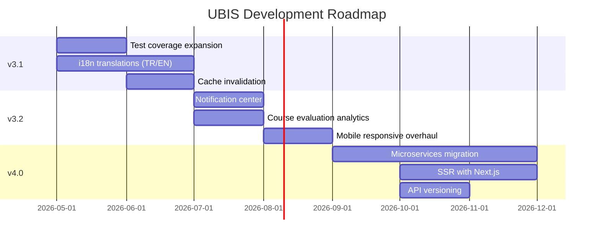

# Roadmap

Strategic development roadmap for UBIS. This document outlines planned features, improvements, and technical debt items.

## Version Timeline

---

## v3.1 — Quality & Stability

**Theme:** Hardening the foundation

### Testing & Quality

| Feature | Priority | Description |
|---------|----------|-------------|
| Controller integration tests | 🔴 P0 | Test all 23 controllers with Supertest |
| Service unit tests | 🔴 P0 | Cover core services (grades, payments, auth) |
| Cypress E2E in CI | 🟡 P1 | Add Cypress to GitHub Actions pipeline |
| Test coverage to 40% | 🟡 P1 | Focus on critical paths first |
| API contract tests | 🟢 P2 | Validate request/response schemas |

### Internationalization

| Feature | Priority | Description |
|---------|----------|-------------|
| Turkish translations | 🔴 P0 | Complete `locales/tr.json` for all UI strings |
| English translations | 🟡 P1 | Complete `locales/en.json` |
| Language switcher | 🟡 P1 | Use Zustand `language` preference |
| RTL support | 🟢 P2 | For potential Arabic language support |

### Caching Improvements

| Feature | Priority | Description |
|---------|----------|-------------|
| Write-through invalidation | 🟡 P1 | Invalidate cache on POST/PUT/DELETE |
| Admin cache flush endpoint | 🟡 P1 | `DELETE /api/admin/cache` |
| Cache warming on startup | 🟢 P2 | Pre-populate commonly accessed data |

---

## v3.2 — User Experience

**Theme:** Polishing the frontend

### Notification System

| Feature | Priority | Description |
|---------|----------|-------------|
| Notification center page | 🔴 P0 | Persistent notification history (not just toasts) |
| Notification persistence | 🔴 P0 | Store notifications in MongoDB |
| Email notification preferences | 🟡 P1 | User-configurable notification channels |
| Push notifications (Web Push) | 🟢 P2 | Browser push via service worker |

### Analytics & Reporting

| Feature | Priority | Description |
|---------|----------|-------------|
| Course evaluation analytics | 🟡 P1 | Charts for instructor evaluation results |
| Attendance analytics | 🟡 P1 | Attendance rate trends by department |
| Export to Excel/PDF | 🟡 P1 | Download reports in multiple formats |
| Student performance prediction | 🟢 P2 | ML-based early warning system |

### UI/UX Improvements

| Feature | Priority | Description |
|---------|----------|-------------|
| Mobile responsive overhaul | 🔴 P0 | Full mobile optimization for all pages |
| Accessibility (WCAG 2.1) | 🟡 P1 | Screen reader support, keyboard navigation |
| Skeleton loading states | 🟡 P1 | Replace spinner with content skeletons |
| Offline mode (PWA) | 🟢 P2 | Offline-first for read-heavy pages |

---

## v4.0 — Architecture Evolution

**Theme:** Scale and modernize

### Backend Architecture

| Feature | Priority | Description |
|---------|----------|-------------|
| API versioning (`/api/v1`, `/api/v2`) | 🔴 P0 | Non-breaking API evolution |
| TypeScript migration | 🟡 P1 | Gradual migration starting with new files |
| Microservices extraction | 🟢 P2 | Auth, Notifications, Analytics as separate services |
| GraphQL gateway | 🟢 P2 | Optional GraphQL layer for flexible queries |

### Frontend Architecture

| Feature | Priority | Description |
|---------|----------|-------------|
| SSR consideration (Next.js) | 🟡 P1 | SEO and initial load performance |
| Monorepo (Turborepo) | 🟢 P2 | Shared packages between client/server |
| Design system package | 🟢 P2 | Extract UI library as npm package |
| Storybook | 🟢 P2 | Visual component documentation |

### Infrastructure

| Feature | Priority | Description |
|---------|----------|-------------|
| CI/CD Docker build + push | 🔴 P0 | Automated container registry publishing |
| Staging environment | 🟡 P1 | Separate staging deployment |
| Blue-green deployments | 🟢 P2 | Zero-downtime deployments |
| MongoDB replica set | 🟢 P2 | Read replicas for analytics queries |
| CDN integration | 🟢 P2 | Static asset delivery via CloudFront/Cloudflare |

---

## Technical Debt

| Item | Severity | Description | Effort |
|------|----------|-------------|--------|
| Register endpoint is public | 🔴 High | Anyone can create accounts | Low |
| JWT in localStorage | 🟡 Medium | XSS token theft risk | Medium |
| Password min length is 6 | 🟡 Medium | Below modern standards | Low |
| CSRF falls back to JWT_SEC | 🟡 Medium | Should always be separate | Low |
| No cursor-based pagination | 🟡 Medium | `skip()` is slow for large datasets | Medium |
| Hardcoded Turkish strings in UI | 🟡 Medium | Blocks i18n completion | High |
| No soft delete | 🟢 Low | Data is permanently deleted | Medium |
| Missing API documentation | 🟢 Low | Not all endpoints have Swagger docs | Medium |
| Some unused lazy imports | 🟢 Low | Dead code in App.jsx | Low |

---

## Completed (v3.0)

- [x] Express 5 migration
- [x] React 19 upgrade
- [x] JWT + 2FA + Google OAuth authentication
- [x] CSRF protection (Double Submit Cookie)
- [x] Redis caching with fallback
- [x] RabbitMQ async messaging
- [x] MeiliSearch full-text search
- [x] Socket.io real-time notifications
- [x] Prometheus + Grafana monitoring
- [x] Docker Compose (dev, prod, monitoring)
- [x] Kubernetes manifests
- [x] GitHub Actions CI
- [x] 121+ frontend pages
- [x] 22 database models
- [x] Comprehensive documentation suite (17+ docs)
