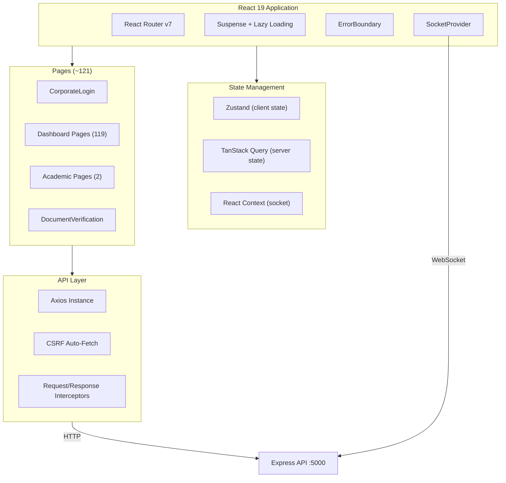

# Frontend Guide

This document describes the React SPA architecture, routing system, state management, API layer, and key patterns used in the UBIS frontend.

## Architecture Overview



## Project Structure

```
client/src/
├── api/
│   └── axiosInstance.js         # Axios config, CSRF, interceptors
├── assets/                      # Static images & icons
├── components/
│   ├── dashboard/               # Dashboard-specific components
│   ├── layout/                  # Sidebar, headers
│   ├── ui/                      # Reusable UI library (13 categories)
│   ├── ErrorBoundary.jsx        # Global error boundary
│   └── PwaInstallPrompt.jsx     # PWA install banner
├── context/
│   └── SocketContext.jsx        # Socket.io provider + notifications
├── hooks/
│   ├── queries/                 # TanStack Query hooks
│   ├── useAnnouncements.js
│   ├── useAttendance.js
│   ├── useClipboard.js
│   ├── useCourses.js
│   ├── useDashboardStats.js
│   ├── useEnrolledCourses.js
│   ├── useGrades.js
│   └── useMediaQuery.js
├── layouts/
│   └── DashboardLayout.jsx      # Main app layout
├── locales/                     # i18n translations (planned)
├── pages/
│   ├── CorporateLogin.jsx       # Login page
│   ├── Dashboard.jsx            # Dashboard home
│   ├── DocumentVerification.jsx # Public verification page
│   ├── dashboard/    (119 files)# All dashboard pages
│   └── academic/     (2 files)  # Academic pages
├── store/
│   └── useAppStore.js           # Zustand persistent store
├── utils/
│   ├── authStorage.js           # Token/user localStorage helpers
│   ├── authFetch.js             # Authenticated fetch wrapper
│   └── DataManager.js           # Data utility helpers
├── App.jsx                      # Root component + routing
├── main.jsx                     # Entry point
├── i18n.js                      # i18next configuration
└── index.css                    # Global styles
```

## Routing

### Route Architecture

All routing is defined in `App.jsx` using React Router v7:

```jsx
<SocketProvider>
  <Router>
    <ErrorBoundary>
      <Suspense fallback={<Loading />}>
        <Routes>
          <Route path="/" element={<Navigate to="/login" />} />
          <Route path="/login" element={<CorporateLogin />} />
          <Route path="/verify-document/:hash" element={<DocumentVerification />} />
          <Route path="/dashboard" element={<PrivateRoute><DashboardLayout /></PrivateRoute>}>
            <Route index element={<Dashboard />} />
            <Route path="grades" element={<Grades />} />
            <Route path="users" element={<RoleRoute allowedRoles={['admin']}><Users /></RoleRoute>} />
            {/* 100+ more routes... */}
          </Route>
          <Route path="*" element={<Navigate to="/login" />} />
        </Routes>
      </Suspense>
    </ErrorBoundary>
  </Router>
</SocketProvider>
```

### Route Guards

| Component | Purpose | Redirect |
|-----------|---------|----------|
| `PrivateRoute` | Requires authentication | → `/login` |
| `RoleRoute` | Requires specific role(s) | → `/dashboard` |

### Code Splitting

Every page uses `React.lazy()` for automatic code splitting:

```javascript
const Grades = lazy(() => import('./pages/dashboard/Grades'));
```

This means each page is a separate JavaScript chunk loaded on demand.

### Page Count by Role

| Role | Accessible Pages | Examples |
|------|-----------------|----------|
| **Student** | ~65 pages | Grades, transcript, course registration, payments, dormitory... |
| **Academic** | ~85 pages | + Grading, advisees, thesis management, proctoring... |
| **Admin** | ~95+ pages | + User management, logs, analytics, system settings... |

---

## State Management

### Client State: Zustand

Minimal persistent store for UI preferences:

```javascript
// store/useAppStore.js
export const useAppStore = create(
    persist(
        (set) => ({
            theme: 'light',
            toggleTheme: () => set((s) => ({ theme: s.theme === 'light' ? 'dark' : 'light' })),
            language: 'tr',
            setLanguage: (lang) => set({ language: lang })
        }),
        { name: 'ubis-app-storage' }  // localStorage key
    )
);
```

**Stored values:** `theme` (light/dark), `language` (tr/en)

### Server State: TanStack Query

Server data is managed via TanStack Query with custom hooks:

```javascript
// hooks/useCourses.js
export const useCourses = () => {
    return useQuery({
        queryKey: ['courses'],
        queryFn: () => axiosInstance.get('/courses').then(r => r.data)
    });
};
```

**Available hooks:** `useCourses`, `useGrades`, `useAnnouncements`, `useAttendance`, `useEnrolledCourses`, `useDashboardStats`, `useClipboard`, `useMediaQuery`

### Real-time State: SocketContext

Global WebSocket connection and notification management:

```javascript
const { socket, notifications, markAsRead, markAllAsRead } = useSocket();
```

---

## API Layer

### Axios Instance

```
axiosInstance.js
├── Base URL: '/api' (Vite proxy handles routing)
├── Credentials: true (for cookies)
├── Timeout: 30 seconds
│
├── Request Interceptor
│   ├── Attach JWT from authStorage
│   └── Attach CSRF token for write methods
│
└── Response Interceptor
    ├── 401 → Clear session, redirect to /login
    ├── 403 (CSRF) → Auto-retry with fresh token (once)
    ├── 400 → Extract Zod validation messages
    └── Network error → Fallback to direct API base (localhost only)
```

### CSRF Token Flow

```
1. App loads → fetchCsrfToken() → GET /api/csrf-token
2. Token stored in module variable
3. Attached to POST/PUT/DELETE/PATCH via X-CSRF-Token header
4. On 403 with CSRF error → auto-refresh and retry
```

---

## Layout System

### DashboardLayout

```
┌──────────────────────────────────────────────────────┐
│ Header (h-16)                                        │
│ ┌─────────┐  ┌──────────────┐  ┌──────────────────┐ │
│ │ Menu ☰  │  │ Search Bar   │  │ Bell 🔔 | Avatar │ │
│ └─────────┘  └──────────────┘  └──────────────────┘ │
├────────────┬─────────────────────────────────────────┤
│            │                                         │
│  Sidebar   │  Main Content Area                      │
│            │  (Scrollable)                            │
│  - Menu    │                                         │
│  - Items   │  ┌─────────────────────────────────┐    │
│  - Groups  │  │ AnimatePresence                  │    │
│            │  │   <Outlet />                     │    │
│            │  │   (Lazy-loaded page)             │    │
│            │  └─────────────────────────────────┘    │
│            │                                         │
├────────────┴─────────────────────────────────────────┤
│                 UbisAiAssistant (floating)            │
└──────────────────────────────────────────────────────┘
```

**Features:**
- Collapsible sidebar with `isSidebarOpen` toggle
- Animated page transitions via `framer-motion` `AnimatePresence`
- Real-time notification badge with unread count
- User info display (name, role, avatar)
- Dark mode support via CSS classes
- Global AI Assistant widget

---

## Error Handling

### ErrorBoundary

Wraps the entire app. Catches React rendering errors and displays a recovery UI.

### Loading Recovery

If a lazy-loaded page takes more than 8 seconds, a recovery UI appears:

```jsx
const Loading = () => {
    const [showRecovery, setShowRecovery] = useState(false);
    useEffect(() => {
        const timeout = setTimeout(() => setShowRecovery(true), 8000);
        return () => clearTimeout(timeout);
    }, []);

    if (showRecovery) {
        return <button onClick={() => {
            clearAuthSession();
            window.location.href = '/login';
        }}>Go to Login</button>;
    }
    return <Spinner />;
};
```

---

## PWA Support

The app includes Progressive Web App support via `vite-plugin-pwa`:

- Service worker registration
- `PwaInstallPrompt` component for install banner
- Offline capability (basic)

---

## Internationalization (i18n)

**Status:** Infrastructure configured, translations pending.

```javascript
// i18n.js
import i18n from 'i18next';
import LanguageDetector from 'i18next-browser-languagedetector';

i18n.use(LanguageDetector).init({
    fallbackLng: 'tr',
    // Translation files in locales/
});
```

The Zustand store tracks `language` preference, but translation JSON files in `locales/` are not yet populated.

---

## Key Libraries

| Library | Version | Purpose |
|---------|---------|---------|
| `react` | 19.2 | UI framework |
| `react-router-dom` | 7.13 | Routing |
| `zustand` | 5.0 | Client state |
| `@tanstack/react-query` | 5.91 | Server state |
| `axios` | 1.13 | HTTP client |
| `framer-motion` | 12.34 | Animations |
| `tailwindcss` | 3.4 | CSS framework |
| `lucide-react` | 0.563 | Icons |
| `recharts` | 3.7 | Charts |
| `react-leaflet` | 5.0 | Maps |
| `react-hook-form` | 7.71 | Form handling |
| `zod` | 4.3 | Validation |
| `socket.io-client` | 4.8 | WebSocket |
| `react-hot-toast` | 2.6 | Toasts |
| `react-toastify` | 11.0 | Toasts (notifications) |
| `dompurify` | 3.4 | XSS prevention |
| `jspdf` | 4.2 | PDF generation |
| `xlsx` | 0.18 | Excel export |
| `qrcode` | 1.5 | QR code generation |
| `@tiptap/react` | 3.19 | Rich text editor |
| `@dnd-kit` | 6.3 | Drag and drop |
| `canvas-confetti` | 1.9 | Celebration effects |
