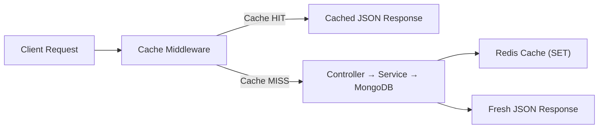

# Caching Strategy

This document describes the Redis caching layer in UBIS, covering the cache middleware, key format, TTL strategy, and fallback behavior.

## Overview

UBIS uses Redis as a response cache layer to reduce database load for frequently accessed, read-heavy endpoints.



## Cache Middleware

**File:** [`server/middleware/cache.js`](../server/middleware/cache.js)

### Behavior

| Step | Action |
|------|--------|
| 1 | Only caches **GET** requests |
| 2 | Checks for `?nocache=1` bypass parameter |
| 3 | Builds user-scoped cache key |
| 4 | Checks Redis for cached data |
| 5a | **HIT**: Returns cached JSON, sets `X-Cache: HIT` |
| 5b | **MISS**: Intercepts `res.json()`, caches response, sets `X-Cache: MISS` |
| 6 | If Redis unavailable → skips caching entirely |

### Configuration

| Property | Value |
|----------|-------|
| TTL | **600 seconds** (10 minutes) |
| Key format | `api-cache:{userId}:{method}:{url}` |
| Bypass | `?nocache=1` query parameter |
| Response header | `X-Cache: HIT` or `X-Cache: MISS` |

### Cache Key Format

```
api-cache:{userId}:{method}:{url}

Examples:
api-cache:664a1b2c:GET:/api/faculties
api-cache:664a1b2c:GET:/api/students/B211200051/360
api-cache:anon:GET:/api/academic-calendar
```

- **User-scoped**: Each user gets their own cache entries (prevents data leakage)
- **URL-based**: Full URL including query parameters
- **Anonymous fallback**: `anon` for unauthenticated requests (rare)

## Cached Endpoints

| Endpoint | Middleware Applied | Purpose |
|----------|-------------------|---------|
| `GET /api/faculties` | ✅ `cacheMiddleware` | Faculty list (rarely changes) |
| `GET /api/departments` | ✅ `cacheMiddleware` | Department list |
| `GET /api/academic-calendar` | ✅ `cacheMiddleware` | Calendar events |
| `GET /api/analytics` | ✅ `cacheMiddleware` | Admin analytics (expensive aggregation) |
| `GET /api/analytics/gpa-distribution` | ✅ `cacheMiddleware` | GPA stats (expensive aggregation) |
| `GET /api/students/:id/360` | ✅ `cacheMiddleware` | Student 360 view (multiple collections) |

## Redis Client

**File:** [`server/utils/redisClient.js`](../server/utils/redisClient.js)

### Connection Strategy

| Property | Value |
|----------|-------|
| URL | `REDIS_URL` env var or `redis://localhost:6379` |
| Max retry attempts | 3 (configurable via `REDIS_MAX_RETRIES`) |
| Reconnect backoff | `min(250ms × 2^retries, 3000ms)` |
| Disable after max retries | Yes (prevents infinite reconnection) |

### Error Handling

- **Connection errors**: Logged once per unique error message (deduplication)
- **Startup failure**: Logged as warning, application continues without Redis
- **After max retries**: Redis features completely disabled

### Rate Limiting Integration

Redis is also used as the store for `express-rate-limit`:

```javascript
store: new RedisStore({
    sendCommand: (...args) => redisClient.sendCommand(args),
})
```

If Redis is unavailable, rate limiting falls back to in-memory storage.

## Cache Invalidation

Currently, UBIS uses a **TTL-based** invalidation strategy:

- Cached data expires after 10 minutes
- No explicit cache invalidation on writes
- `?nocache=1` can force a fresh response

### Considerations

| Strategy | Current | Recommended |
|----------|---------|-------------|
| TTL expiry | ✅ 10 min | Keep as-is |
| Write-through invalidation | ❌ Not implemented | Add for frequently updated data |
| Manual flush | ❌ Not exposed | Add admin endpoint |
| Cache warming | ❌ Not implemented | Consider for analytics |

## Monitoring

The `X-Cache` response header allows easy monitoring:

```bash
# Check if response is cached
curl -I http://localhost:5000/api/faculties
# X-Cache: HIT  → served from Redis
# X-Cache: MISS → served from MongoDB
```
