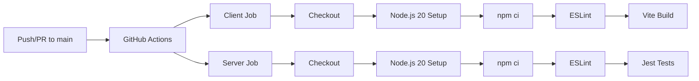
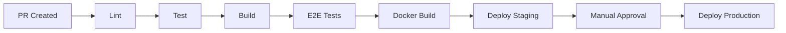

# CI/CD Pipeline

This document describes the Continuous Integration and Continuous Deployment pipeline for UBIS using GitHub Actions.

## Pipeline Overview



## Workflow Configuration

**File:** [`.github/workflows/ci.yml`](../.github/workflows/ci.yml)

### Triggers

```yaml
on:
  pull_request:
    branches: [main]
  push:
    branches: [main]
```

The pipeline runs on:
- Every **push** to `main`
- Every **pull request** targeting `main`

## Jobs

### Client Job

| Step | Command | Purpose |
|------|---------|---------|
| Checkout | `actions/checkout@v4` | Clone repository |
| Node.js Setup | `actions/setup-node@v4` (Node 20) | Install Node.js with npm cache |
| Install | `npm ci` | Install dependencies (lockfile-based) |
| Lint | `npm run lint` | ESLint check |
| Build | `npm run build` | Vite production build |

**Cache:** npm cache using `client/package-lock.json` as key.

### Server Job

| Step | Command | Purpose |
|------|---------|---------|
| Checkout | `actions/checkout@v4` | Clone repository |
| Node.js Setup | `actions/setup-node@v4` (Node 20) | Install Node.js with npm cache |
| Install | `npm ci` | Install dependencies (lockfile-based) |
| Lint | `npm run lint` | ESLint check |
| Test | `npm test` | Jest tests (8 test files) |

**Cache:** npm cache using `server/package-lock.json` as key.

## ESLint Configuration

### Client

**File:** [`client/eslint.config.js`](../client/eslint.config.js)

| Plugin | Purpose |
|--------|---------|
| `@eslint/js` | Core JavaScript rules |
| `eslint-plugin-react-hooks` | React Hooks rules |
| `eslint-plugin-react-refresh` | React Refresh compatibility |

**CI command:** `npm run lint` (warnings allowed)
**Strict mode:** `npm run lint:ci` (zero warnings, `--max-warnings 0`)

### Server

**File:** [`server/eslint.config.js`](../server/eslint.config.js)

| Plugin | Purpose |
|--------|---------|
| `@eslint/js` | Core JavaScript rules |
| `globals` | Node.js global definitions |

**CI command:** `npm run lint`
**Strict mode:** `npm run lint:ci` (`--quiet`, errors only)

## What's Currently Tested

| Area | CI Coverage | Details |
|------|------------|---------|
| Client lint | ✅ | Full ESLint check |
| Client build | ✅ | Ensures build succeeds |
| Server lint | ✅ | Full ESLint check |
| Server unit tests | ✅ | 8 test files via Jest |
| Client E2E (Cypress) | ❌ | Not in CI |
| Docker build | ❌ | Not in CI |
| Deployment | ❌ | Not automated |

## Recommended Improvements

### Phase 1: Enhanced Testing

```yaml
# Add Cypress E2E to client job
- name: Cypress E2E
  uses: cypress-io/github-action@v6
  with:
    working-directory: client
    build: npm run build
    start: npm run preview
```

### Phase 2: Docker Build & Push

```yaml
# New job: Build and push Docker images
docker:
  needs: [client, server]
  runs-on: ubuntu-latest
  steps:
    - uses: docker/build-push-action@v5
      with:
        context: .
        file: docker/server.Dockerfile
        target: production
        push: true
        tags: ghcr.io/org/ubis-server:latest
```

### Phase 3: Deployment Automation

```yaml
# Deploy to staging after successful build
deploy-staging:
  needs: [docker]
  runs-on: ubuntu-latest
  environment: staging
  steps:
    - name: Deploy to staging
      run: |
        ssh staging 'cd /opt/ubis && docker compose pull && docker compose up -d'
```

### Phase 4: Full Pipeline



## Branch Protection (Recommended)

| Rule | Setting |
|------|---------|
| Require PR reviews | 1 approver |
| Require status checks | client, server jobs |
| Require branch up-to-date | Yes |
| Restrict force pushes | Yes |
| Restrict deletions | Yes |
