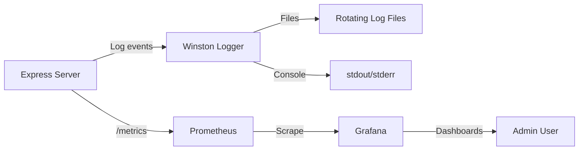

# Monitoring

This document describes the observability stack in UBIS: Prometheus metrics, Grafana dashboards, and Winston structured logging.

## Monitoring Architecture



## Prometheus Metrics

### Setup

**Library:** `express-prom-bundle` + `prom-client`

```javascript
// server/index.js
const metricsMiddleware = promBundle({
    includeMethod: true,
    includePath: true,
    includeStatusCode: true,
    includeUp: true,
    customLabels: { project_name: 'ubis_obs' },
    promClient: { collectDefaultMetrics: {} }
});
app.use(metricsMiddleware);
```

### Default Metrics

`express-prom-bundle` automatically collects:

| Metric | Type | Description |
|--------|------|-------------|
| `http_request_duration_seconds` | Histogram | Request duration by method, path, status |
| `http_requests_total` | Counter | Total request count |
| `up` | Gauge | Application up status |
| Node.js default metrics | Various | CPU, memory, event loop, GC |

### Custom Metrics

**File:** [`server/utils/metrics.js`](../server/utils/metrics.js)

| Metric | Type | Labels | Description |
|--------|------|--------|-------------|
| `auth_attempts_total` | Counter | `action`, `result` | Auth operation counts |
| `auth_operation_duration_ms` | Histogram | `action` | Auth operation timing |

**Actions tracked:**
- `register` (success/error)
- `login` (success/error)
- `forgot_password` (success/error)
- `reset_password` (success/error)
- `generate_2fa` (success/error)
- `verify_2fa` (success/error)

### Metrics Endpoint

```
GET http://localhost:5000/metrics
```

Returns Prometheus-formatted metrics text.

## Grafana

### Docker Setup

```bash
cd docker
docker compose -f docker-compose.monitoring.yml up -d
```

| Service | Port | Default Credentials |
|---------|------|-------------------|
| **Prometheus** | 9090 | — |
| **Grafana** | 3001 | admin/admin |

### Prometheus Configuration

**File:** [`docker/prometheus.yml`](../docker/prometheus.yml)

```yaml
scrape_configs:
  - job_name: 'ubis-server'
    scrape_interval: 15s
    static_configs:
      - targets: ['server:5000']
```

### Pre-configured Dashboards

Dashboard configurations are stored in `docker/grafana/`.

**Recommended panels:**
- Request rate (req/sec)
- Response time percentiles (p50, p95, p99)
- Error rate (4xx, 5xx)
- Auth attempts by action
- Auth operation duration
- Node.js memory usage
- Event loop lag

## Winston Logging

### Configuration

**File:** [`server/utils/logger.js`](../server/utils/logger.js)

| Property | Value |
|----------|-------|
| Library | `winston` v3 + `winston-daily-rotate-file` |
| Format | JSON (production), Colorized (development) |
| Levels | error, warn, info, debug |
| Rotation | Daily file rotation |

### Log Levels

| Level | Usage | Example |
|-------|-------|---------|
| `error` | Application errors, crashes | `logger.error('Database connection failed')` |
| `warn` | Degraded state, fallbacks | `logger.warn('Redis unavailable, using memory')` |
| `info` | Normal operations | `logger.info('Server started on port 5000')` |
| `debug` | Detailed debugging | `logger.debug('Published event to queue')` |

### HTTP Request Logging

| Environment | Logger | Output |
|-------------|--------|--------|
| Development | Morgan (`dev` format) | Console (colored, concise) |
| Production | Morgan (`combined` format) | Piped through Winston |

```javascript
if (process.env.NODE_ENV === 'development') {
    app.use(morgan('dev'));
} else {
    app.use(morgan('combined', {
        stream: { write: message => logger.info(message.trim()) }
    }));
}
```

### Docker Log Management

All Docker services use JSON file logging with rotation:

| Service | Max Size | Max Files |
|---------|----------|-----------|
| Server (dev) | 10MB | 3 |
| Server (prod) | 50MB | 5 |
| Client | 10MB | 3 |
| MongoDB (prod) | 20MB | 5 |
| Redis (prod) | 10MB | 3 |
| RabbitMQ (prod) | 20MB | 3 |

## Health Monitoring

### Application Health Check

```bash
curl http://localhost:5000/
# Response: "IAU UBIS API is running"
```

### Service Health Checks

All Docker services have health checks (see [Deployment](./DEPLOYMENT.md#health-checks)):

```bash
# Check service health
docker compose ps

# View health logs
docker inspect --format='{{json .State.Health}}' ubis_server
```

## Alerting (Recommendations)

Currently, UBIS does not have automated alerting. Recommended additions:

| Alert | Condition | Channel |
|-------|-----------|---------|
| High error rate | 5xx > 5% for 5 min | Slack/Email |
| Server down | Health check fails 3x | PagerDuty |
| High latency | p99 > 5s for 10 min | Slack |
| Auth brute force | auth_attempts > 50/min | Security team |
| Disk space | Volume > 80% full | Ops team |
| Redis connection lost | Redis disconnected | Slack |
