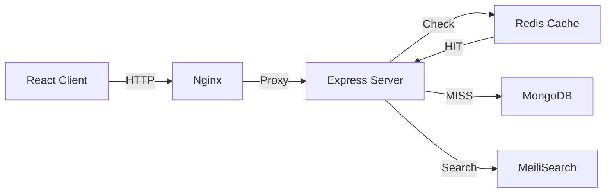

# Performance

This document covers performance optimizations, bottleneck analysis, and tuning recommendations for UBIS.

## Current Performance Architecture



---

## Frontend Performance

### Code Splitting

All 121+ pages use `React.lazy()` for automatic code splitting:

```javascript
const Grades = lazy(() => import('./pages/dashboard/Grades'));
```

**Impact:** Initial bundle only loads the login page. Dashboard pages are loaded on demand.

### Bundle Optimization

| Technique | Status | Details |
|-----------|--------|---------|
| Code splitting | ✅ | Every page is a separate chunk |
| Tree shaking | ✅ | Vite default (ES modules) |
| CSS purging | ✅ | TailwindCSS JIT mode |
| Image optimization | ⚠️ | Manual (not automated) |
| Font subsetting | ❌ | Full font files loaded |
| Prefetching | ❌ | No route prefetching implemented |

### Animation Performance

Framer Motion animations use GPU-accelerated properties:
- `transform` (translate, scale, rotate)
- `opacity`
- Avoids layout-triggering properties (width, height, top, left)

### Loading Recovery

The app includes an 8-second timeout for lazy-loaded pages. If a page fails to load, users see a recovery button to redirect to login.

---

## Backend Performance

### Database Query Optimization

#### Indexes

22 models have carefully designed indexes. Key compound indexes:

| Collection | Index | Query Pattern |
|-----------|-------|---------------|
| `emails` | `{ receiver: 1, read: 1, createdAt: -1 }` | Inbox listing with unread filter |
| `students` | `{ faculty: 1, department: 1 }` | Department-level student queries |
| `transactions` | `{ userId: 1, date: -1 }` | User transaction history |
| `announcements` | `{ category: 1, createdAt: -1 }` | Category-filtered feeds |

#### Pagination

All list endpoints support pagination via `ApiFeatures`:
- Default limit: configurable per endpoint
- Maximum limit: 100 items per page
- Uses MongoDB `skip()` and `limit()`

#### Aggregation Pipelines

Complex analytics use MongoDB aggregation for server-side computation:
```javascript
// GPA distribution - computed in MongoDB, not in Node.js
Student.aggregate([
    { $group: { _id: "$faculty", avgGpa: { $avg: "$gpa" } } }
]);
```

### Redis Caching

| Cached Endpoint | TTL | Reason |
|----------------|-----|--------|
| `GET /api/faculties` | 10 min | Rarely changes |
| `GET /api/departments` | 10 min | Rarely changes |
| `GET /api/academic-calendar` | 10 min | Changes semester-level |
| `GET /api/analytics` | 10 min | Expensive aggregation |
| `GET /api/analytics/gpa-distribution` | 10 min | Expensive aggregation |
| `GET /api/students/:id/360` | 10 min | Multi-collection join |

**Cache hit rate monitoring:** Check the `X-Cache` response header (`HIT` or `MISS`).

### Connection Pooling

| Service | Pool Strategy |
|---------|--------------|
| MongoDB | Mongoose default pool (5 connections) |
| Redis | Single connection with auto-reconnect |
| RabbitMQ | Single channel, reused across publishes |

---

## Infrastructure Performance

### Docker Resource Limits (Production)

| Service | Memory Limit | CPU Limit | Memory Reservation |
|---------|-------------|-----------|-------------------|
| Server | 512MB | 1.0 CPU | 256MB |
| Client (Nginx) | 128MB | 0.5 CPU | 64MB |

### Nginx Optimization (Production)

| Feature | Status | Details |
|---------|--------|---------|
| Gzip compression | ✅ | Enabled for text, JS, CSS, JSON |
| Static file caching | ✅ | Cache-Control headers for assets |
| Connection keep-alive | ✅ | Nginx default |
| HTTP/2 | ⚠️ | Requires SSL configuration |
| Brotli compression | ❌ | Not configured |

### Log Rotation

All Docker services use JSON file logging with size limits (10-50MB per file, 3-5 files max).

---

## Performance Monitoring

### Prometheus Metrics

Key metrics to track:

| Metric | Meaning | Alert Threshold |
|--------|---------|----------------|
| `http_request_duration_seconds{quantile="0.99"}` | p99 latency | > 5 seconds |
| `http_requests_total{status="5xx"}` | Error rate | > 5% for 5 min |
| `nodejs_heap_used_bytes` | Memory usage | > 400MB |
| `nodejs_active_handles_total` | Active handles | Continuously growing |
| `nodejs_eventloop_lag_seconds` | Event loop lag | > 100ms |

### Endpoint-Level Metrics

```
GET /metrics → Prometheus format
```

Includes per-endpoint duration histograms (method + path + status code).

---

## Bottleneck Analysis

### Known Bottlenecks

| Area | Bottleneck | Impact | Mitigation |
|------|-----------|--------|-----------|
| **Student 360** | Multi-collection aggregation | Slow response | ✅ Redis cached (10 min) |
| **Analytics** | Full-collection aggregation | Expensive query | ✅ Redis cached (10 min) |
| **Search** | MeiliSearch network latency | Search speed | ✅ MeiliSearch is sub-50ms |
| **Login** | bcrypt hash comparison | ~100ms per login | ✅ Acceptable, rate limited |
| **File uploads** | 10MB max file size | Memory spike | ⚠️ Consider streaming |
| **Lazy loading** | 121 separate chunks | Many HTTP requests | ⚠️ Consider route prefetching |

### Scaling Considerations

| Scenario | Current Capacity | Scale Strategy |
|----------|-----------------|----------------|
| < 100 concurrent users | ✅ Single server | No action needed |
| 100-500 users | ⚠️ Monitor closely | Increase Docker resources |
| 500-2000 users | ❌ Likely bottleneck | K8s with 3+ replicas, Redis cluster |
| 2000+ users | ❌ Needs redesign | MongoDB sharding, CDN, microservices |

---

## Optimization Recommendations

### High Priority

| # | Optimization | Effort | Impact |
|---|-------------|--------|--------|
| 1 | Add MongoDB `explain()` for slow queries | Low | High |
| 2 | Implement write-through cache invalidation | Medium | High |
| 3 | Add route prefetching for adjacent pages | Low | Medium |
| 4 | Enable HTTP/2 with Nginx SSL | Low | Medium |

### Medium Priority

| # | Optimization | Effort | Impact |
|---|-------------|--------|--------|
| 5 | Implement cursor-based pagination (instead of skip) | Medium | High for large datasets |
| 6 | Add Brotli compression to Nginx | Low | Low-Medium |
| 7 | Font subsetting (load only used glyphs) | Low | Low |
| 8 | Image optimization pipeline (sharp/imagemin) | Medium | Medium |

### Low Priority

| # | Optimization | Effort | Impact |
|---|-------------|--------|--------|
| 9 | Service worker offline caching for static assets | Medium | Low |
| 10 | MongoDB read replicas for analytics queries | High | High for scale |
| 11 | CDN for static assets | Medium | Medium |
| 12 | WebSocket connection pooling | Medium | Low |
