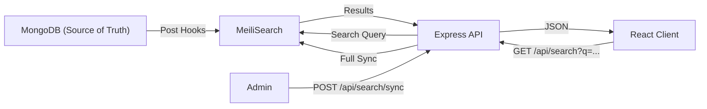

# Search

This document covers the MeiliSearch full-text search integration in UBIS, including index configuration, auto-sync hooks, and the search API.

## Overview

UBIS uses **MeiliSearch 1.6** as a full-text search engine, running as a separate service alongside MongoDB. Data is automatically synchronized from MongoDB to MeiliSearch via Mongoose post-hooks.



## MeiliSearch Client

**File:** [`server/utils/meiliClient.js`](../server/utils/meiliClient.js)

| Property | Value |
|----------|-------|
| Host | `MEILI_HOST` env var or `http://localhost:7700` |
| API Key | `MEILI_MASTER_KEY` env var |
| Health check | Automatic on startup |

## Indexes

| Index Name | Source Model | Synced Fields | Purpose |
|-----------|-------------|---------------|---------|
| `students` | User (student role) | `id`, `username`, `fullName`, `email` | Student search |
| `courses` | Course | `id`, `code`, `title` (name), `instructor`, `credits` | Course search |
| `announcements` | Announcement | `id`, `title`, `text`, `category` | Announcement search |

## Auto-Sync Hooks

Three Mongoose models have `post` hooks that automatically sync data to MeiliSearch:

### User Model (Student Role Only)

```javascript
// Only syncs users with role === 'student'
UserSchema.post('save', async function(doc) {
    if (doc.role === 'student') {
        await meiliClient.index('students').addDocuments([{
            id: doc._id.toString(),
            username: doc.username,
            fullName: doc.fullName,
            email: doc.email
        }]);
    }
});
```

**Hooks:** `post('save')`, `post('findOneAndUpdate')`, `post('findOneAndDelete')`

### Course Model

```javascript
CourseSchema.post('save', async function(doc) {
    await meiliClient.index('courses').addDocuments([{
        id: doc._id.toString(),
        code: doc.code,
        title: doc.name,
        instructor: doc.instructor,
        credits: doc.credit
    }]);
});
```

**Hooks:** `post('save')`, `post('findOneAndUpdate')`, `post('findOneAndDelete')`

### Announcement Model

```javascript
AnnouncementSchema.post('save', async function(doc) {
    await meiliClient.index('announcements').addDocuments([{
        id: doc._id.toString(),
        title: doc.title,
        text: doc.text,
        category: doc.category
    }]);
});
```

**Hooks:** `post('save')`, `post('findOneAndUpdate')`, `post('findOneAndDelete')`

### Error Handling

All sync hooks are wrapped in try-catch blocks. Errors are logged via Winston but **never** propagate to the main application flow:

```javascript
} catch (err) {
    logger.error('Meili Index Error (User Save):', err.message);
}
```

This ensures the application continues working even if MeiliSearch is unavailable.

## Search API

### GET `/api/search?q={query}`

🔒 **Requires:** `verifyToken`

Performs a multi-index search across students, courses, and announcements.

**Query Parameters:**

| Parameter | Type | Description |
|-----------|------|-------------|
| `q` | string | Search query text |

**Response:**
```json
{
  "students": [
    { "id": "664a...", "username": "B211200051", "fullName": "Eyüp Salihoğlu" }
  ],
  "courses": [
    { "id": "665b...", "code": "BLM101", "title": "Bilgisayar Mühendisliğine Giriş" }
  ],
  "announcements": [
    { "id": "666c...", "title": "Kayıt Yenileme Duyurusu" }
  ]
}
```

### POST `/api/search/sync`

🔒 **Requires:** `admin` role

Manually triggers a full synchronization of MongoDB data to MeiliSearch indexes. Useful for:
- Initial setup after deployment
- Recovering from MeiliSearch data loss
- After bulk data imports

## Administration

### MeiliSearch Dashboard

In development, MeiliSearch provides a web UI at `http://localhost:7700`:
- Browse indexes
- Test search queries
- View index settings
- Monitor indexing status

### Docker Configuration

```yaml
meilisearch:
  image: getmeili/meilisearch:v1.6
  ports:
    - "7700:7700"
  environment:
    MEILI_MASTER_KEY: ${MEILI_MASTER_KEY:-}
  volumes:
    - meili_data:/meili_data/data.ms
  healthcheck:
    test: ["CMD", "wget", "--spider", "http://127.0.0.1:7700/health"]
```

### Data Flow

```
1. Admin imports students via seed script
2. Each Student record is saved to MongoDB
3. Mongoose post('save') hook fires
4. Hook sends document to MeiliSearch index
5. MeiliSearch indexes the document (async)
6. User searches via /api/search?q=eyüp
7. MeiliSearch returns matching results instantly
```
