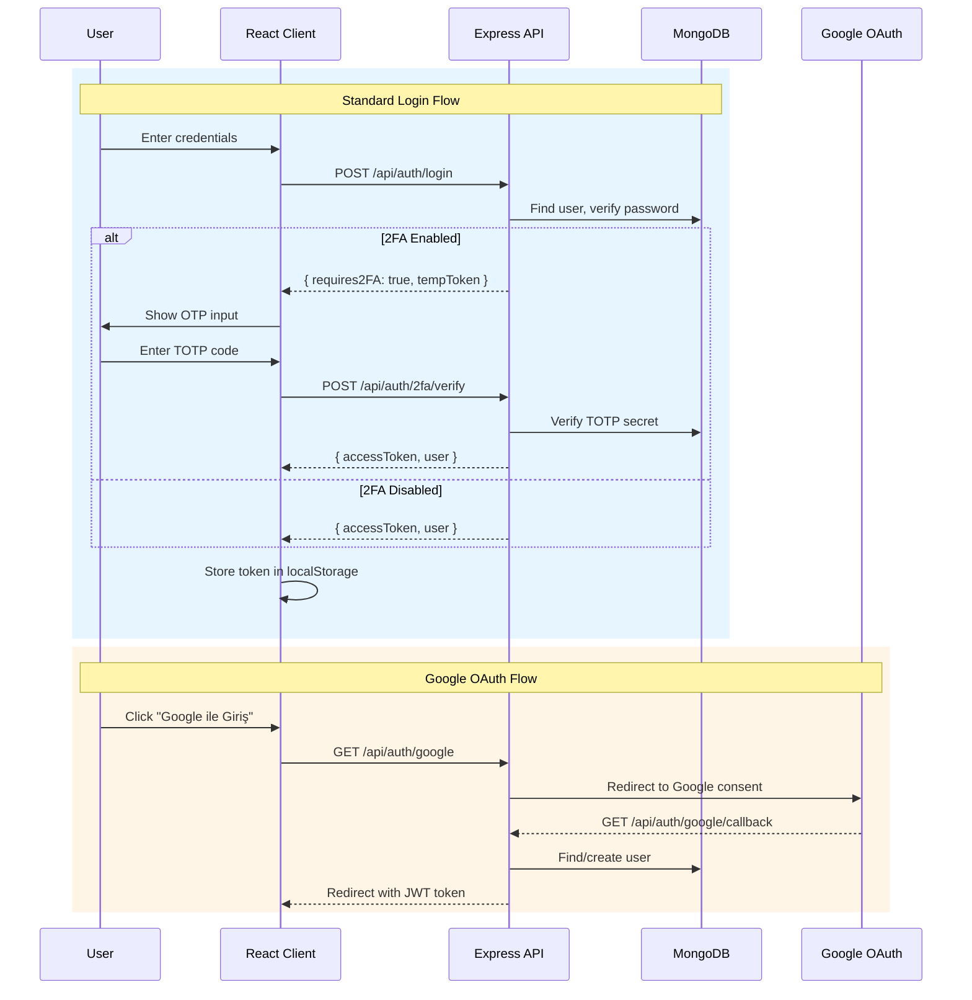
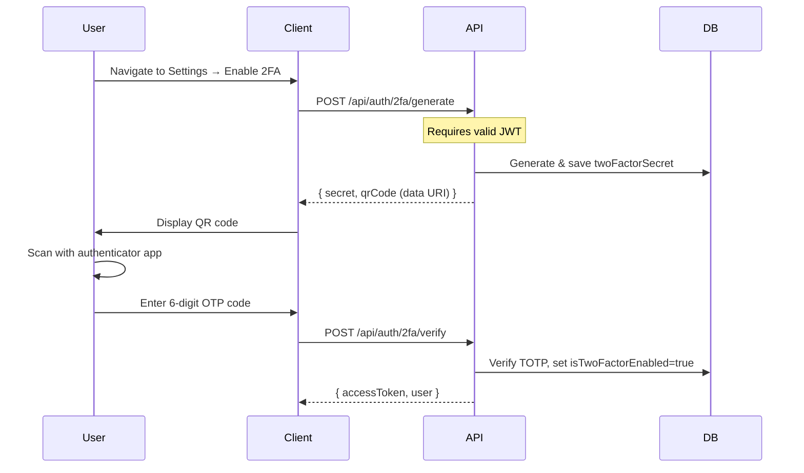
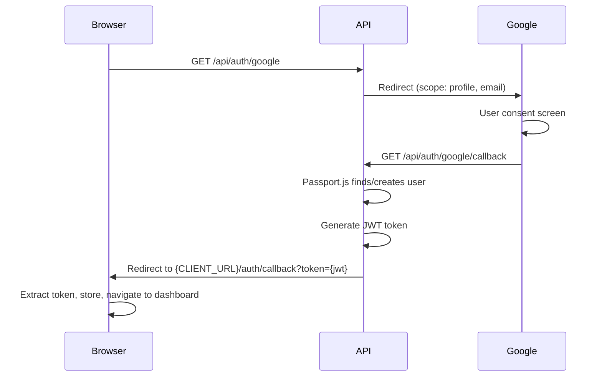
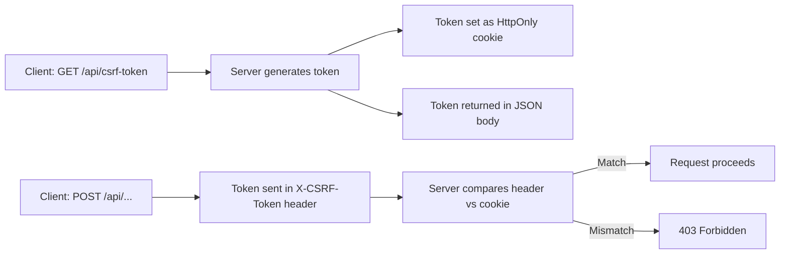
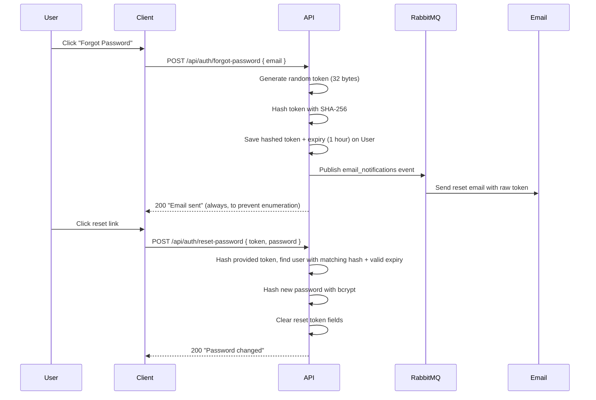

# Authentication

This document describes the complete authentication and authorization system in UBIS, covering JWT tokens, 2FA, Google OAuth, CSRF protection, and role-based access control.

## Authentication Flow Overview



## JWT (JSON Web Tokens)

### Token Structure

```json
{
  "id": "664a1b2c3d4e5f6a7b8c9d0e",
  "role": "student",
  "username": "B211200051",
  "iat": 1714588800,
  "exp": 1714592400
}
```

### Token Configuration

| Property | Value | Source |
|----------|-------|--------|
| **Algorithm** | HS256 (default) | jsonwebtoken |
| **Expiration** | 1 hour | `authService.js` |
| **Secret** | `JWT_SEC` env var | `.env` |
| **Payload** | `id`, `role`, `username` | `authService.js` |

### Token Lifecycle

1. **Generation**: On successful login (`authService.loginUser`)
2. **Storage**: Client stores in `localStorage` via `authStorage.js`
3. **Transmission**: Sent in `Authorization: Bearer <token>` header
4. **Verification**: `verifyToken` middleware decodes and attaches `req.user`
5. **Expiration**: After 1 hour, client receives 401 and is redirected to login

### Client-Side Token Management

```
axiosInstance.js
├── Request Interceptor
│   ├── Reads token from authStorage.getToken()
│   └── Attaches Authorization: Bearer <token>
│
└── Response Interceptor
    ├── 401 → clearAuthSession() → redirect to /login
    └── 403 (CSRF) → auto-retry with fresh CSRF token
```

---

## Two-Factor Authentication (2FA)

UBIS supports TOTP-based 2FA using the **Speakeasy** library.

### 2FA Setup Flow



### 2FA Login Flow

1. User submits username + password
2. Server detects `user.isTwoFactorEnabled === true`
3. Server returns `{ requires2FA: true, tempToken }` (10-min expiry)
4. Client shows OTP input screen
5. User enters TOTP code from authenticator app
6. Server verifies with Speakeasy → issues full JWT token

### TOTP Configuration

| Property | Value |
|----------|-------|
| Library | `speakeasy` v2.x |
| QR Code | `qrcode.toDataURL()` |
| Secret label | `UBIS_{username}` |
| Encoding | Base32 |
| Temp token expiry | 10 minutes |

---

## Google OAuth 2.0

### Flow



### Configuration

| Property | Value | Source |
|----------|-------|--------|
| Strategy | `passport-google-oauth20` | `passportConfig.js` |
| Scopes | `profile`, `email` | `routes/auth.js` |
| Session | Disabled (`session: false`) | Stateless JWT |
| Failure redirect | `/login` | — |
| Success redirect | `{CLIENT_URL}/auth/callback?token={jwt}` | — |
| Env vars | `GOOGLE_CLIENT_ID`, `GOOGLE_CLIENT_SECRET` | `.env` |

---

## CSRF Protection

UBIS uses the **Double Submit Cookie** pattern via the `csrf-csrf` library.

### How It Works



### Configuration

| Property | Development | Production |
|----------|------------|------------|
| Cookie name | `ubis.x-csrf-token` | `__Host-ubis.x-csrf-token` |
| Cookie `httpOnly` | `true` | `true` |
| Cookie `sameSite` | `strict` | `strict` |
| Cookie `secure` | `false` | `true` |
| Cookie `path` | `/` | `/` |
| Token size | 64 bytes | 64 bytes |
| Ignored methods | GET, HEAD, OPTIONS | GET, HEAD, OPTIONS |
| Token from request | `req.headers['x-csrf-token']` | `req.headers['x-csrf-token']` |
| Secret source | `CSRF_SECRET` or `JWT_SEC` | `CSRF_SECRET` (required) |

### Client Integration

The Axios instance automatically handles CSRF:

1. **On app load**: Fetches CSRF token via `GET /api/csrf-token`
2. **On write requests**: Attaches `X-CSRF-Token` header
3. **On 403 (CSRF error)**: Auto-retries by refreshing the token (once)

### Route Order (Important!)

```javascript
// 1. Auth routes BEFORE CSRF (login/register don't need CSRF)
app.use("/api/auth", authRoute);

// 2. CSRF token endpoint
app.get('/api/csrf-token', ...);

// 3. CSRF protection applied to ALL remaining /api routes
app.use('/api', doubleCsrfProtection);

// 4. Protected routes AFTER CSRF
app.use("/api/courses", verifyToken, coursesRoute);
```

---

## Role-Based Access Control (RBAC)

### Roles

| Role | Value | Description |
|------|-------|-------------|
| **Student** | `student` | Default role, access to personal data |
| **Academic** | `academic` | Instructors, research assistants, advisors |
| **Admin** | `admin` | Full system access |

### Authorization Middleware

UBIS has 4 authorization middleware functions:

#### `verifyToken`

Validates JWT token from `Authorization` header. Attaches `req.user` with `{ id, role, username }`.

```javascript
// Usage: Applied to most protected routes
app.use("/api/courses", verifyToken, coursesRoute);
```

#### `verifyRole(roles[])`

Combines token verification + role check. Used at route-mount level.

```javascript
// Usage: Entire route group requires admin
app.use("/api/logs", verifyRole(['admin']), logsRoute);
```

#### `restrictTo(...roles)`

Role check only (requires `verifyToken` to have run first). Used at individual route level.

```javascript
// Usage: Specific endpoint within a protected route group
router.post('/', restrictTo('admin', 'academic'), controller.create);
```

#### `verifyOwnerOrStaff`

Checks if the requesting user is the resource owner OR has staff privileges. Supports both MongoDB ObjectId and username matching.

```javascript
// Usage: Student profile access
router.get('/:id', verifyOwnerOrStaff, studentController.getById);
```

### Access Matrix

| Endpoint Group | Student | Academic | Admin |
|---------------|---------|----------|-------|
| `/api/auth/*` | ✅ | ✅ | ✅ |
| `/api/courses` | ✅ (read) | ✅ (read/write) | ✅ |
| `/api/grades` | ✅ (read own) | ✅ (read/write) | ✅ |
| `/api/students` | ✅ (own only) | ✅ | ✅ |
| `/api/assignments` | ✅ | ✅ | ✅ |
| `/api/announcements` | ✅ (read) | ✅ (read/write) | ✅ |
| `/api/users` | ❌ | ❌ | ✅ |
| `/api/logs` | ❌ | ❌ | ✅ |
| `/api/analytics` | ❌ | ❌ | ✅ |
| `/api/evaluations/all` | ❌ | ❌ | ✅ |
| `/api/payments/finance-stats` | ❌ | ❌ | ✅ |
| `/api/search/sync` | ❌ | ❌ | ✅ |

---

## Password Management

### Hashing

| Property | Value |
|----------|-------|
| Library | `bcrypt` v6 |
| Salt rounds | 10 |
| Algorithm | bcrypt (adaptive) |

### Password Reset Flow



### Security Features

- **Email enumeration prevention**: Always returns 200 regardless of email existence
- **Token hashing**: Raw token sent to email, SHA-256 hash stored in DB
- **Token expiry**: 1 hour from generation
- **One-time use**: Token fields cleared after successful reset
- **Minimum password**: 6 characters (could be strengthened)

---

## Client-Side Auth Storage

**File:** [`client/src/utils/authStorage.js`](../client/src/utils/authStorage.js)

| Function | Purpose |
|----------|---------|
| `getToken()` | Read JWT from localStorage |
| `getUser()` | Read user object from localStorage |
| `getUserRole()` | Extract role from stored user |
| `isAuthenticated()` | Check if valid token exists |
| `clearAuthSession()` | Remove all auth data from localStorage |

### Frontend Route Guards

| Component | Purpose |
|-----------|---------|
| `PrivateRoute` | Redirects to `/login` if not authenticated |
| `RoleRoute` | Redirects to `/dashboard` if role not in `allowedRoles` |

```jsx
// Student can access
<Route path="grades" element={<Grades />} />

// Only admin can access
<Route path="users" element={
  <RoleRoute allowedRoles={['admin']}>
    <Users />
  </RoleRoute>
} />
```
