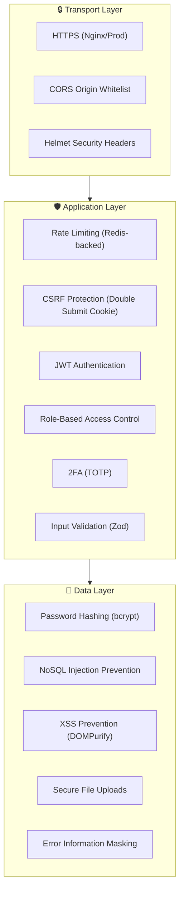

# Security

This document describes the security architecture, threat model, and hardening measures implemented in UBIS.

## Security Layers



## Implemented Security Measures

### 1. HTTP Security Headers (Helmet)

Helmet.js is applied globally and sets the following headers:

| Header | Purpose |
|--------|---------|
| `X-Content-Type-Options: nosniff` | Prevents MIME type sniffing |
| `X-Frame-Options: SAMEORIGIN` | Clickjacking protection |
| `X-XSS-Protection` | Browser XSS filtering |
| `Strict-Transport-Security` | HTTPS enforcement (prod) |
| `Content-Security-Policy` | Script/resource loading restrictions |
| `X-DNS-Prefetch-Control` | DNS prefetch control |
| `Referrer-Policy` | Referrer information control |

### 2. CORS (Cross-Origin Resource Sharing)

```javascript
origin: (origin, callback) => {
    if (!origin || allowedOrigins.includes(origin)) {
        callback(null, true);
    } else {
        callback(new Error('Not allowed by CORS'));
    }
}
```

| Property | Value |
|----------|-------|
| Allowed origins | `CLIENT_URL` env var (comma-separated) |
| Methods | GET, POST, PUT, DELETE, PATCH |
| Credentials | `true` (cookies sent) |
| Non-origin requests | Allowed (server-to-server) |

### 3. Rate Limiting

| Limiter | Scope | Max Requests | Window | Backend |
|---------|-------|-------------|--------|---------|
| **General** | `/api/*` | 100 | 15 min | Redis (or in-memory fallback) |
| **Auth** | `/api/auth/*` | 20 | 15 min | Redis (or in-memory fallback) |

Features:
- Standard `RateLimit-*` headers in response
- Redis-backed for distributed environments
- Automatic fallback to in-memory when Redis is unavailable
- Legacy headers disabled

### 4. CSRF Protection

See [Authentication — CSRF Protection](./AUTHENTICATION.md#csrf-protection) for details.

| Property | Value |
|----------|-------|
| Pattern | Double Submit Cookie |
| Library | `csrf-csrf` v3.x |
| Cookie (dev) | `ubis.x-csrf-token` |
| Cookie (prod) | `__Host-ubis.x-csrf-token` |
| Token extraction | `X-CSRF-Token` header |
| Ignored methods | GET, HEAD, OPTIONS |

### 5. NoSQL Injection Prevention

Two layers of protection:

**Layer 1 — `mongoSanitizeCompat` middleware:**
Strips `$` operators from request body, query, and params.

**Layer 2 — `ApiFeatures.filter()` sanitization:**
```javascript
// Only allows safe comparison operators
const allowedOperators = ['gte', 'gt', 'lte', 'lt'];

// Rejects any remaining $ operators from user input
const sanitize = (obj) => {
    for (const key of Object.keys(obj)) {
        if (key.startsWith('$') && !['$gte', '$gt', '$lte', '$lt'].includes(key)) {
            delete obj[key];
        }
    }
};
```

### 6. Input Validation (Zod)

Request body validation using Zod schemas for critical endpoints:

| Schema | Endpoint | Fields |
|--------|----------|--------|
| `register` | POST `/auth/register` | username (3-30), email, password (6-128) |
| `login` | POST `/auth/login` | username, password |
| `forgotPassword` | POST `/auth/forgot-password` | email |
| `announcement` | POST `/announcements` | title (3-200), text (5+), category |
| `evaluation` | POST `/evaluations` | courseId, answers, comment (max 1000) |

### 7. Password Security

| Property | Value |
|----------|-------|
| Algorithm | bcrypt (adaptive) |
| Salt rounds | 10 |
| Min length | 6 characters |
| Reset token | 32 random bytes → SHA-256 hash |
| Reset expiry | 1 hour |
| Enumeration prevention | Always returns 200 for forgot-password |

### 8. Authentication & Authorization

See [Authentication](./AUTHENTICATION.md) for complete details.

| Feature | Implementation |
|---------|---------------|
| JWT tokens | 1-hour expiry, HS256 |
| 2FA | TOTP via Speakeasy |
| Google OAuth | Passport.js |
| Role-based access | `verifyToken`, `verifyRole`, `restrictTo`, `verifyOwnerOrStaff` |

### 9. File Upload Security

**Middleware:** `secureUploads.js`

| Control | Value |
|---------|-------|
| Library | Multer v2 |
| Max file size | **10 MB** |
| Allowed types | `jpeg`, `jpg`, `png`, `pdf`, `doc`, `docx`, `zip`, `rar` |
| Access control | Token-based serving |
| Upload directory | `/uploads` (with ownership control) |

### 10. XSS Prevention (Client)

| Library | Purpose |
|---------|---------|
| `DOMPurify` | Sanitizes HTML content before rendering |
| React JSX | Auto-escapes interpolated values |
| Helmet CSP | Restricts inline scripts |

### 11. Error Information Masking

```javascript
if (process.env.NODE_ENV === 'production') {
    if (err.isOperational) {
        // Safe error message returned
        res.status(err.statusCode).json({ message: err.message });
    } else {
        // Programming error: generic message, no stack trace
        res.status(500).json({ message: 'Something went very wrong!' });
    }
}
```

### 12. Redis Security

| Environment | Configuration |
|-------------|---------------|
| Development | No password, internal network only (no port exposure) |
| Production | Password required (`--requirepass`), no host port |

### 13. MongoDB Security

| Environment | Configuration |
|-------------|---------------|
| Development | No authentication |
| Production | Root user + dedicated app user, `mongo-init.js` initialization |

### 14. Socket.io Authentication

```javascript
io.use((socket, next) => {
    const token = socket.handshake.auth?.token;
    if (!token) return next(new Error('Authentication required'));
    const decoded = jwt.verify(token, process.env.JWT_SEC);
    socket.user = decoded;
    next();
});
```

---

## Security Headers Summary

| Header | Status | Notes |
|--------|--------|-------|
| `X-Content-Type-Options` | ✅ | Helmet |
| `X-Frame-Options` | ✅ | Helmet |
| `Strict-Transport-Security` | ✅ | Helmet (prod with HTTPS) |
| `Content-Security-Policy` | ✅ | Helmet defaults |
| `X-XSS-Protection` | ✅ | Helmet |
| `Referrer-Policy` | ✅ | Helmet |
| `X-Cache` | ✅ | Cache middleware (HIT/MISS) |
| `RateLimit-*` | ✅ | Rate limiter |
| CORS headers | ✅ | Configured |

---

## Known Considerations

| Item | Severity | Description | Recommendation |
|------|----------|-------------|----------------|
| JWT in localStorage | Medium | Vulnerable to XSS token theft | Consider HttpOnly cookie storage |
| Shared CSRF/JWT fallback | Low | `CSRF_SECRET` falls back to `JWT_SEC` | Always set separate `CSRF_SECRET` |
| Password min length | Low | 6 characters is below modern standards | Increase to 8+ with complexity rules |
| Register endpoint | Medium | Currently open to all | Restrict to admin-only for production |
